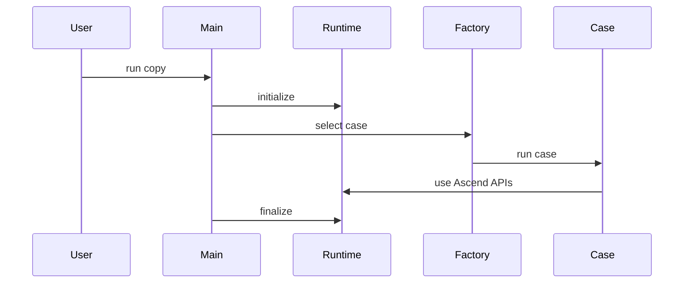
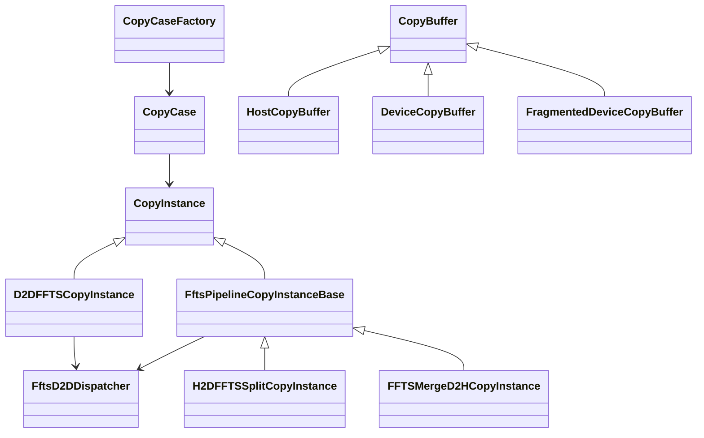
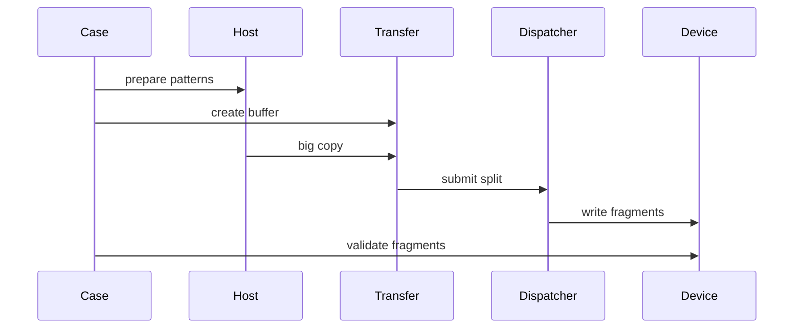
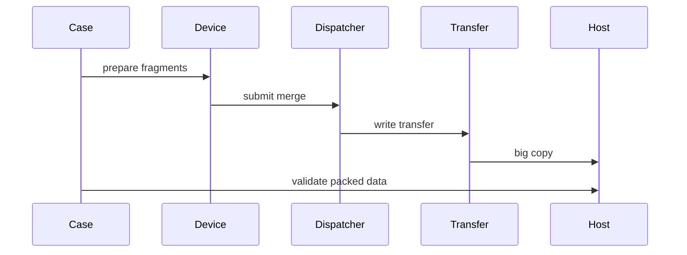
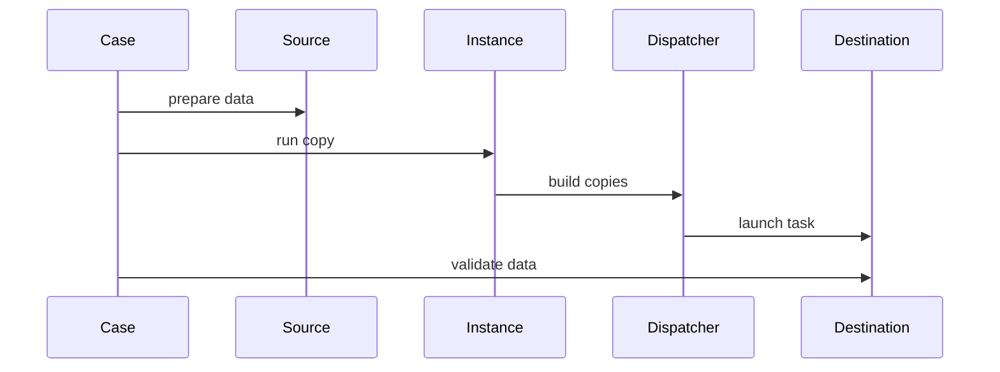
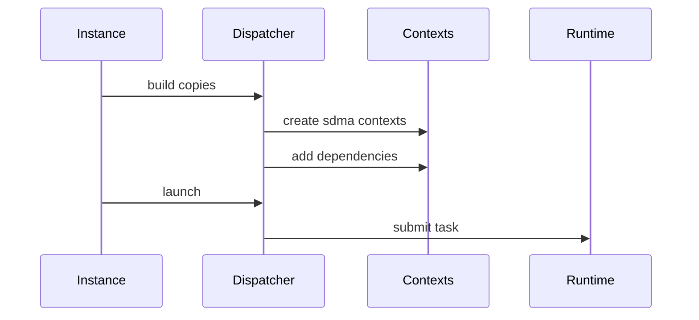
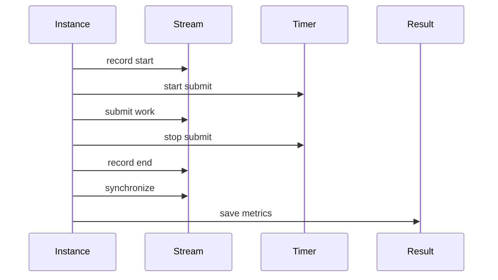

# Ascend FFTS Copy 代码走读

## 总览

当前 FFTS 相关代码挂在 `module/copy` 的 Ascend 后端里，目标不是新增一个独立 benchmark binary，而是复用现有 `copy` CLI、case 注册机制、buffer 抽象和 `CopyResult` 输出。

核心路径分成两类：

- 纯 D2D FFTS：`ascend_d2d_merge_ffts` 和 `ascend_d2d_split_ffts`
- H2D/D2H pipeline：`ascend_h2d_ffts_split` 和 `ascend_ffts_merge_d2h`

涉及的主要文件：

`@lzx-sandbox/dev-sandbox/module/copy/copy_main.cc`

`@lzx-sandbox/dev-sandbox/module/copy/copy_case.h`

`@lzx-sandbox/dev-sandbox/module/copy/copy_instance.h`

`@lzx-sandbox/dev-sandbox/module/copy/ascend/copy_runtime_ascend.cc`

`@lzx-sandbox/dev-sandbox/module/copy/ascend/copy_buffer_ascend.h`

`@lzx-sandbox/dev-sandbox/module/copy/ascend/copy_case_ffts_d2d_ascend.cc`

`@lzx-sandbox/dev-sandbox/module/copy/ascend/copy_instance_ffts_ascend.h`

`@lzx-sandbox/dev-sandbox/module/copy/ascend/copy_instance_ffts_pipeline_ascend.h`

`@lzx-sandbox/dev-sandbox/module/copy/ascend/ffts_d2d_dispatcher_ascend.h`

`@lzx-sandbox/dev-sandbox/module/copy/CMakeLists.txt`

## 编译接入

Ascend 后端编译时会先收集 `ascend` 目录下的实现文件，然后把 FFTS case 文件从默认列表里移除。只有检测到 FFTS runtime header 和 `libruntime` 后，才把 FFTS case 重新加入编译。

这意味着：

- 没有 FFTS runtime 环境时，普通 Ascend copy case 仍可编译。
- 有 FFTS runtime 环境时，`copy` binary 才会包含 FFTS 相关 case。
- FFTS include 目录和 runtime library 由 CMake 检测结果注入，不在源码里硬编码路径。

对应文件：

`@lzx-sandbox/dev-sandbox/module/copy/CMakeLists.txt`

## 入口路径

CLI 入口在 `copy_main.cc`。它完成三件事：

1. 解析 `-t`、`-s`、`-n`、`-i`、`-d` 参数。
2. 构造 `CopyRuntime`，Ascend 后端会在构造时调用 `aclInit`，析构时调用 `aclFinalize`。
3. 通过 `CopyCaseFactory` 按 case name 过滤并执行目标 case。

case 注册由 `DEFINE_COPY_CASE` 宏完成。每个 case 文件里的静态 registrar 会在程序启动时把 case 放进 `CopyCaseFactory`。



对应文件：

`@lzx-sandbox/dev-sandbox/module/copy/copy_main.cc`

`@lzx-sandbox/dev-sandbox/module/copy/copy_case.h`

`@lzx-sandbox/dev-sandbox/module/copy/ascend/copy_runtime_ascend.cc`

## 类关系

下面这张图只表达当前 FFTS copy 路径里最重要的类关系。



几个角色的职责：

- `CopyCase`：定义一个可运行 case，负责创建 buffer、初始化数据、调用 copy instance、校验结果、展示结果。
- `CopyInstance`：定义统一测量框架，返回 `CopyResult::Result`。
- `D2DFFTSCopyInstance`：把一组 D2D copy spec 交给 FFTS dispatcher，一次 launch。
- `FftsPipelineCopyInstanceBase`：给 H2D/D2H pipeline 提供 stream、event、transfer buffer 和计时逻辑。
- `H2DFFTSSplitCopyInstance`：一次大 H2D 后，用 FFTS split 到多个离散 device buffer。
- `FFTSMergeD2HCopyInstance`：先用 FFTS merge 到连续 device transfer buffer，再一次大 D2H 回 host。
- `FftsD2DDispatcher`：把 copy spec 转成 FFTS SDMA context，构造依赖关系并调用 runtime launch。

## Buffer 模型

FFTS pipeline 依赖三种 buffer 形态：

`HostCopyBuffer`

- Host 侧连续大块 pinned allocation。
- `buffer[0]` 可以作为大 IO 首地址。
- `buffer[i]` 是连续大块中的第 `i` 个 fragment offset。

`DeviceCopyBuffer`

- Device 侧连续大块 allocation。
- 用作普通连续 device buffer，也用作 H2D/D2H pipeline 的 transfer buffer。
- `buffer[0]` 可以作为大 IO 首地址。

`FragmentedDeviceCopyBuffer`

- 每个 fragment 是独立 device allocation。
- 用来模拟业务里的批量小 IO 目标或来源。
- `buffer[i]` 返回第 `i` 个独立 fragment 地址。

对应文件：

`@lzx-sandbox/dev-sandbox/module/copy/ascend/copy_buffer_ascend.h`

## Case 层路径

FFTS case 都集中在 `copy_case_ffts_d2d_ascend.cc`。

当前四个 case：

- `ascend_d2d_merge_ffts`
- `ascend_d2d_split_ffts`
- `ascend_h2d_ffts_split`
- `ascend_ffts_merge_d2h`

纯 D2D case 使用 `D2DFFTSCopyInstance`。H2D/D2H pipeline case 使用 `H2DFFTSSplitCopyInstance` 或 `FFTSMergeD2HCopyInstance`。

case 层还负责数据正确性：

- `MakePattern` 为每个 fragment 生成不同 pattern。
- `InitializePatternedBuffer` 把 pattern 写入 device buffer。
- `InitializeHostPatternedBuffer` 把 pattern 写入 host packed buffer。
- `ValidatePatternedBuffer` 从 device fragment 回读并比较 pattern。
- `ValidateHostPatternedBuffer` 直接检查 host packed buffer 的每个 fragment offset。

对应文件：

`@lzx-sandbox/dev-sandbox/module/copy/ascend/copy_case_ffts_d2d_ascend.cc`

## H2D Big Copy + FFTS Split

这个路径对应 case：

`ascend_h2d_ffts_split`

目标是把批量小 H2D 变成一次大 H2D，然后在 device 内部用 FFTS split。

数据方向：

```text
Host packed buffer -> Device transfer buffer -> Device fragmented buffers
```

代码路径：

1. case 创建 `HostCopyBuffer` 和 `FragmentedDeviceCopyBuffer`。
2. case 调用 `InitializeHostPatternedBuffer`，把不同 pattern 写入 host 连续大块。
3. case 调用 `ResetBuffer` 清空目标 fragmented device buffer。
4. case 创建 `H2DFFTSSplitCopyInstance` 并调用 `DoCopy`。
5. instance 的 `PrepareCommon` 创建连续 `DeviceCopyBuffer` 作为 transfer buffer，创建 stream 和 event，并计算 `totalBytes`。
6. instance 的 `Prepare` 保存 host base 和 transfer base，同时构造 `transfer fragment -> device fragment` 的 FFTS copy specs。
7. instance 的 `DoCopyOnce` 在同一个 stream 上先提交一次大 H2D，再提交 FFTS launch。
8. instance 记录 start/end event，同步 stream，用 event elapsed time 得到整条 pipeline 的 `Copy(us)`。
9. case 调用 `ValidatePatternedBuffer` 校验每个 device fragment。



关键点：

- H2D 阶段只调用一次 `aclrtMemcpyAsync`，长度是 `size * number`。
- FFTS spec 数量仍是 `number`，每个 spec 负责一个 fragment。
- 大 H2D 和 FFTS launch 使用同一个 stream，按 stream 顺序执行。
- `Submit(us)` 包含 Host 侧提交大 H2D 和 FFTS launch 的时间。
- `Copy(us)` 是 event 统计的完整 pipeline 时间，包含大 H2D 和 FFTS split。

对应文件：

`@lzx-sandbox/dev-sandbox/module/copy/ascend/copy_instance_ffts_pipeline_ascend.h`

## FFTS Merge + D2H Big Copy

这个路径对应 case：

`ascend_ffts_merge_d2h`

目标是先在 device 内部把离散 fragment merge 到连续 transfer buffer，再一次大 D2H 回 host。

数据方向：

```text
Device fragmented buffers -> Device transfer buffer -> Host packed buffer
```

代码路径：

1. case 创建 `FragmentedDeviceCopyBuffer` 和 `HostCopyBuffer`。
2. case 调用 `InitializePatternedBuffer`，把不同 pattern 写入每个 device fragment。
3. case 调用 `ResetHostBuffer` 清空 host packed buffer。
4. case 创建 `FFTSMergeD2HCopyInstance` 并调用 `DoCopy`。
5. instance 的 `PrepareCommon` 创建连续 `DeviceCopyBuffer` 作为 transfer buffer，创建 stream 和 event，并计算 `totalBytes`。
6. instance 的 `Prepare` 保存 transfer base 和 host base，同时构造 `device fragment -> transfer fragment` 的 FFTS copy specs。
7. instance 的 `DoCopyOnce` 在同一个 stream 上先提交 FFTS launch，再提交一次大 D2H。
8. instance 记录 start/end event，同步 stream，用 event elapsed time 得到整条 pipeline 的 `Copy(us)`。
9. case 调用 `ValidateHostPatternedBuffer` 校验 host packed buffer 中每个 fragment offset。



关键点：

- D2H 阶段只调用一次 `aclrtMemcpyAsync`，长度是 `size * number`。
- FFTS spec 数量仍是 `number`。
- FFTS launch 和大 D2H 使用同一个 stream，按 stream 顺序执行。
- `Copy(us)` 是完整 pipeline 时间，包含 FFTS merge 和大 D2H。

对应文件：

`@lzx-sandbox/dev-sandbox/module/copy/ascend/copy_instance_ffts_pipeline_ascend.h`

## 纯 D2D FFTS Path

纯 D2D case 是更薄的一层封装，用来验证和测量 FFTS 只做 device 内部 copy batch 的能力。

代码路径：

1. case 创建 source buffer 和 destination buffer。
2. case 初始化 source pattern，清空 destination。
3. case 创建 `D2DFFTSCopyInstance`。
4. `D2DFFTSCopyInstance` 把 `ctx.src` 和 `ctx.dst` 转成 `AscendD2DCopySpec` 列表。
5. dispatcher 构造 FFTS contexts 并一次 launch。
6. case 校验 destination pattern。



对应文件：

`@lzx-sandbox/dev-sandbox/module/copy/ascend/copy_instance_ffts_ascend.h`

`@lzx-sandbox/dev-sandbox/module/copy/ascend/copy_case_ffts_d2d_ascend.cc`

## FFTS Dispatcher 内部

`FftsD2DDispatcher` 是 FFTS 路径里最核心的封装。它把上层传入的 D2D copy list 转成 runtime 可以识别的 FFTS Plus task。

主要数据结构：

- `AscendD2DCopySpec`：上层 copy 描述，包含 dst、src、size。
- `rtFftsPlusComCtx_t`：FFTS Plus context 的通用 128 字节记录。
- `rtFftsPlusSdmaCtx_t`：把通用 context 解释成 SDMA copy context。
- `rtFftsPlusSqe_t`：一次 FFTS Plus task 的 SQE 描述。
- `rtFftsPlusTaskInfo_t`：传给 runtime launch API 的任务信息。

dispatcher 的执行步骤：

1. `BuildCopies` 先 `Reset`，避免 warmup 和多轮 iteration 累积旧 context。
2. 每个 copy spec 调用 `AddMemcpy`，生成一个 SDMA context。
3. `BuildCopies` 把 copy 分配到最多 8 条 ready lane。
4. 同一 lane 内相邻任务用 `AddDependency` 串起来。
5. `Launch` 构造 SQE 和 task info。
6. `Launch` 调用 `rtFftsPlusTaskLaunchWithFlag`，把任务提交到同一个 Ascend stream。



对应文件：

`@lzx-sandbox/dev-sandbox/module/copy/ascend/ffts_d2d_dispatcher_ascend.h`

## Dependency 与 Ready Lane

FFTS dispatcher 不是简单把所有 context 全部设为 ready。它把 copies 分到最多 8 条 lane：

- `readyContextNum` 等于 lane 数。
- 每条 lane 的第一个 context 是 ready context。
- 同一 lane 上的后续 context 通过 predecessor/successor 关系串起来。

这样做的效果是：

- Runtime 看到的是一个 FFTS Plus task。
- task 内部可以有多个 ready context 并发起步。
- 每条 lane 内的 context 保持依赖顺序。

这部分逻辑在 `BuildCopies` 和 `AddDependency` 中。

对应文件：

`@lzx-sandbox/dev-sandbox/module/copy/ascend/ffts_d2d_dispatcher_ascend.h`

## Runtime Launch 边界

仓库内可见的最后一步是调用 `rtFftsPlusTaskLaunchWithFlag`。调用时传入的是同一个 `aclrtStream` 转换后的 runtime stream。

对于 H2D split：

```text
aclrtMemcpyAsync -> rtFftsPlusTaskLaunchWithFlag
```

对于 merge D2H：

```text
rtFftsPlusTaskLaunchWithFlag -> aclrtMemcpyAsync
```

这两段都在同一个 stream 上连续提交。stream 语义保证同一 stream 上任务按提交顺序执行，所以不需要在 H2D 和 FFTS 之间额外同步。

从 CANN runtime 内部看，FFTS Plus launch 会继续进入 runtime 的 FFTS Plus task launch 路径，并最终形成 Stars SQE 提交。这个内部路径不在当前仓库源码里，当前仓库只负责构造 task info 并调用 runtime API。

对应文件：

`@lzx-sandbox/dev-sandbox/module/copy/ascend/ffts_d2d_dispatcher_ascend.h`

## 计时路径

`CopyInstance` 的统一输出是 `CopyResult::Result`，包含：

- source name
- destination name
- method name
- 单个 fragment size
- fragment count
- submit time array
- copy time array

H2D/D2H pipeline 的计时在 `FftsPipelineCopyInstanceBase` 中完成。

一次 `DoCopyOnce` 的顺序：

1. 在 stream 上记录 start event。
2. 开始 Host 侧 submit timer。
3. 执行提交 lambda。
4. 结束 Host 侧 submit timer。
5. 在 stream 上记录 end event。
6. 同步 stream。
7. 用 event elapsed time 计算 copy time。



因此：

- `Submit(us)` 是 Host 侧提交整条 pipeline 的耗时。
- `Copy(us)` 是 stream 上 start event 到 end event 之间的设备侧耗时。
- H2D split 的 `Copy(us)` 包含大 H2D 和 FFTS split。
- merge D2H 的 `Copy(us)` 包含 FFTS merge 和大 D2H。
- `BW(GB/s)` 使用 `size * count` 作为有效 payload，不把 H2D 和 device 内部 copy 的物理搬运量重复相加。

对应文件：

`@lzx-sandbox/dev-sandbox/module/copy/ascend/copy_instance_ffts_pipeline_ascend.h`

`@lzx-sandbox/dev-sandbox/module/copy/copy_result.h`

## 正确性校验路径

FFTS case 的 correctness check 在 case 层做，不计入 `Copy(us)`。

H2D split 校验：

1. Host packed buffer 按 fragment 写入 pattern。
2. pipeline 完成后，从 fragmented device buffer 逐个回读。
3. 每个 fragment 与同 index 的 pattern 比较。

merge D2H 校验：

1. 每个 fragmented device source 写入 pattern。
2. pipeline 完成后，检查 host packed buffer 每个 fragment offset。
3. 每个 offset 与同 index 的 pattern 比较。

纯 D2D 校验：

1. source buffer 写入 pattern。
2. destination buffer 清零。
3. FFTS copy 完成后回读 destination。
4. 每个 fragment 与同 index 的 pattern 比较。

对应文件：

`@lzx-sandbox/dev-sandbox/module/copy/ascend/copy_case_ffts_d2d_ascend.cc`

## 四个 Case 的差异

| Case | Source | Intermediate | Destination | Method |
| --- | --- | --- | --- | --- |
| `ascend_d2d_merge_ffts` | fragmented device | none | continuous device | FFTS |
| `ascend_d2d_split_ffts` | continuous device | none | fragmented device | FFTS |
| `ascend_h2d_ffts_split` | packed host | continuous device transfer | fragmented device | big H2D + FFTS |
| `ascend_ffts_merge_d2h` | fragmented device | continuous device transfer | packed host | FFTS + big D2H |

这里的 `Intermediate` 只存在于 H2D/D2H pipeline。纯 D2D FFTS case 直接从 source spec 到 destination spec。

## 常见读代码误区

### AddMemcpy 不是执行点

`AddMemcpy` 只是把一个 copy spec 转成 SDMA context 并追加到 `contexts_`。真正提交给 runtime 的地方是 `Launch`。

对应文件：

`@lzx-sandbox/dev-sandbox/module/copy/ascend/ffts_d2d_dispatcher_ascend.h`

### H2D split 不是 N 次 H2D

`ascend_h2d_ffts_split` 的 H2D 阶段是一笔大 H2D，大小是 `size * number`。N 个 fragment 的拆分由 FFTS 在 device 内部完成。

对应文件：

`@lzx-sandbox/dev-sandbox/module/copy/ascend/copy_instance_ffts_pipeline_ascend.h`

### merge D2H 不是 N 次 D2H

`ascend_ffts_merge_d2h` 的 D2H 阶段是一笔大 D2H，大小是 `size * number`。N 个 fragment 的聚合由 FFTS 在 device 内部完成。

对应文件：

`@lzx-sandbox/dev-sandbox/module/copy/ascend/copy_instance_ffts_pipeline_ascend.h`

### 同一个 Stream 上不需要额外同步

pipeline 中连续提交的两个任务使用同一个 stream。前一个提交成功后，后一个任务可以立刻入队，但执行顺序仍由 stream 保证。

对应文件：

`@lzx-sandbox/dev-sandbox/module/copy/ascend/copy_instance_ffts_pipeline_ascend.h`

`@lzx-sandbox/dev-sandbox/module/copy/ascend/ffts_d2d_dispatcher_ascend.h`

## 推荐阅读顺序

第一次读这部分代码，可以按下面顺序：

1. `@lzx-sandbox/dev-sandbox/module/copy/copy_main.cc`
2. `@lzx-sandbox/dev-sandbox/module/copy/copy_case.h`
3. `@lzx-sandbox/dev-sandbox/module/copy/ascend/copy_runtime_ascend.cc`
4. `@lzx-sandbox/dev-sandbox/module/copy/ascend/copy_buffer_ascend.h`
5. `@lzx-sandbox/dev-sandbox/module/copy/ascend/copy_case_ffts_d2d_ascend.cc`
6. `@lzx-sandbox/dev-sandbox/module/copy/ascend/copy_instance_ffts_pipeline_ascend.h`
7. `@lzx-sandbox/dev-sandbox/module/copy/ascend/copy_instance_ffts_ascend.h`
8. `@lzx-sandbox/dev-sandbox/module/copy/ascend/ffts_d2d_dispatcher_ascend.h`

这个顺序会先看到 CLI 如何进入 case，再看到 buffer 如何表达连续和离散数据，最后再看 FFTS descriptor 和 runtime launch。
