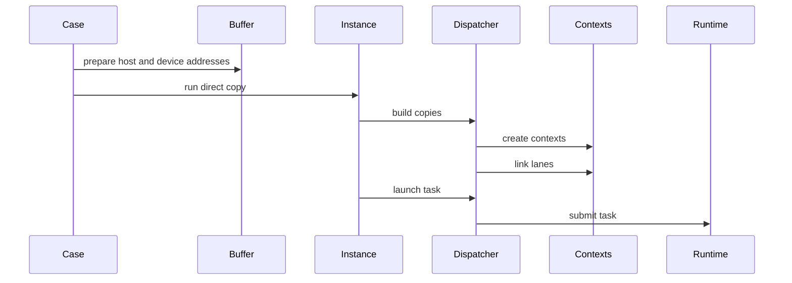

# FFTS Host Direct 一段式代码走读

## 总览

一段式 direct 路径的核心变化是去掉中间 device transfer buffer。H2D 不再先做大 H2D 再 split，D2H 也不再先 merge 再大 D2H，而是直接把 Host 侧地址形态和 fragmented device 地址写进 FFTS SDMA context，由一次 FFTS launch 描述整批 fragment copy。

相关代码位置：

`@module/copy/ascend/copy_case_ffts_d2d_ascend.cc`

`@module/copy/ascend/copy_instance_ffts_host_direct_ascend.h`

`@module/copy/ascend/ffts_d2d_dispatcher_ascend.h`

`@module/copy/ascend/copy_buffer_ascend.h`

最重要的判断是：一段式不是把 N 个 fragment 变成一个 SDMA context，而是把 N 个 Host/Device copy spec 组织成一个 FFTS Plus task。这个 task 内部有 N 个 SDMA context，最多 8 个 context 作为初始 ready lane，其余 context 通过依赖链继续触发。

## Case 入口

当前 direct 路径注册了六个 case：

- `ascend_h2d_ffts_direct`
- `ascend_ffts_d2h_direct`
- `ascend_reg_h2d_ffts_direct`
- `ascend_ffts_d2h_reg_direct`
- `ascend_regv2_h2d_ffts_direct`
- `ascend_ffts_d2h_regv2_direct`

普通版本使用 `HostCopyBuffer`，Host 内存来自 `aclrtMallocHost`，传给 FFTS 的是原始 Host pointer。

register 版本使用 `MallocHostRegisterCopyBuffer`，Host 内存同样来自 `aclrtMallocHost`，随后调用 `aclrtHostRegister`，并把接口输出的 mapped device pointer 传给 FFTS。

registerV2 版本使用 `MallocHostRegisterV2CopyBuffer`，Host 内存同样来自 `aclrtMallocHost`，随后调用 `aclrtHostRegisterV2` 和 `aclrtHostGetDevicePointer`，并把获取到的 mapped device pointer 传给 FFTS。

H2D direct 的 case 做三件事：

1. 准备 Host packed buffer。
2. 准备 fragmented device destination。
3. 调用 `H2DFFTSDirectCopyInstance`。

D2H direct 的 case 也做三件事：

1. 准备 fragmented device source。
2. 准备 Host packed destination。
3. 调用 `FFTSDirectD2HCopyInstance`。

case 层还负责 pattern 初始化和正确性校验。对于 register 和 registerV2 buffer，CPU 初始化和 CPU 校验必须走原始 Host pointer，不能走映射后的 device pointer。

## Host Buffer 地址语义

这里要把两个地址分开看：

| 地址 | 谁使用 | 用途 |
| --- | --- | --- |
| Host pointer | CPU | 初始化 Host 数据、清零 Host 数据、校验 D2H 结果 |
| mapped device pointer | FFTS SDMA context | 作为一段式 direct copy 的 Host 侧 source 或 destination |

`MallocHostRegisterCopyBuffer` 内部保存两份地址：

- `hostAddr_` 是 `aclrtMallocHost` 返回的 Host pointer。
- `deviceAddr_` 是 `aclrtHostRegister` 输出的 mapped device pointer。

`MallocHostRegisterV2CopyBuffer` 也保存两份地址：

- `hostAddr_` 是 `aclrtMallocHost` 返回的 Host pointer。
- `deviceAddr_` 是 `aclrtHostGetDevicePointer` 返回的 mapped device pointer。

这两个 mapped buffer 的 `At` 返回 `deviceAddr_` 加 fragment offset，因此 direct instance 看到的是 device pointer。它们额外提供 `HostAt`，让 case 层初始化和校验时仍然访问 CPU 可见的 Host pointer。

## 一次执行的主链路

一段式 direct 的执行链路如下：



图里 `Contexts` 表示 dispatcher 内部保存的 FFTS context 数组，不是额外的 device transfer buffer。

## Direct Instance 的职责

direct instance 的职责很窄：它不关心 Host pointer 是原始地址还是 mapped device pointer，也不直接调用 runtime launch。它只把 source 和 destination buffer 映射成 `AscendFftsCopySpec` 列表。

代码位置：

`@module/copy/ascend/copy_instance_ffts_host_direct_ascend.h`

### 公共准备

`FftsHostDirectCopyInstanceBase` 负责公共资源：

- 选定当前 device。
- 保存单个 fragment size。
- 保存 fragment count。
- 计算总 payload bytes。
- 创建一个 Ascend stream。
- 创建 start/end event。
- 保存 `fftsCopies`。
- 持有 `FftsD2DDispatcher`。

这里没有创建 `DeviceCopyBuffer`。这是 direct 路径和两段式 pipeline 的关键差异。

### H2D Direct Copy Spec

`H2DFFTSDirectCopyInstance` 在 prepare 阶段遍历所有 fragment，为每个 fragment 生成一条 copy spec。

每条 spec 的含义是：

| 字段 | 含义 |
| --- | --- |
| `dst` | 第 i 个 fragmented device destination |
| `src` | Host packed buffer 的第 i 个 offset |
| `size` | 单个 fragment 的大小 |

对于普通版本，`src` 是原始 Host pointer 加 offset。对于 register 和 registerV2 版本，`src` 是 mapped device pointer 加 offset。

### D2H Direct Copy Spec

`FFTSDirectD2HCopyInstance` 的 prepare 逻辑方向相反。

每条 spec 的含义是：

| 字段 | 含义 |
| --- | --- |
| `dst` | Host packed buffer 的第 i 个 offset |
| `src` | 第 i 个 fragmented device source |
| `size` | 单个 fragment 的大小 |

对于普通版本，`dst` 是原始 Host pointer 加 offset。对于 register 和 registerV2 版本，`dst` 是 mapped device pointer 加 offset。

## Copy Spec 到 FFTS Context

任务构造的核心在 dispatcher。

代码位置：

`@module/copy/ascend/ffts_d2d_dispatcher_ascend.h`

上层传入的是 `AscendFftsCopySpec`，它只有三个字段：

- `dst`
- `src`
- `size`

dispatcher 不判断地址来自 Host 还是 Device，只把指针值拆成 SDMA context 的源地址和目的地址字段。因此 direct 方案能否跑通，取决于 runtime 和硬件是否接受这些地址形态。

## BuildCopies

`BuildCopies` 是把一组 copy spec 组织成 FFTS context 图的入口。

它做四件事：

1. 清空上一轮 context，避免 warmup 和多轮 iteration 之间复用旧任务。
2. 为本轮 copies 预留 context 数组容量。
3. 计算 ready lane 数量，最多 8 条。
4. 遍历 copy spec，逐条生成 SDMA context，并按 lane 建依赖链。

ready lane 的数量是：

```text
min(copy_count, 8)
```

如果 copy count 小于等于 8，每个 context 都可以作为初始 ready context。如果 copy count 大于 8，只有前 8 个 lane 的头部 context 是初始 ready，后面的 context 按 lane 串起来。

## AddMemcpy

`AddMemcpy` 的名字容易误解。它不是执行 memcpy，而是把一条 copy spec 变成一个 FFTS SDMA context，并追加到 dispatcher 内部的 context 数组。

它的构造过程是：

1. 创建一个 128 字节的通用 FFTS context。
2. 把这个通用 context 按 SDMA context 解释。
3. 填入 SDMA context 类型。
4. 填入 thread 维度。
5. 填入 SDMA SQE header。
6. 把 source 指针拆成高低 32 位写入 source address。
7. 把 destination 指针拆成高低 32 位写入 destination address。
8. 写入数据长度。
9. 把这个 context 追加到 context 数组。

这里写进去的是上层传入的地址值。对 H2D direct 来说，source address 是 Host 侧地址形态，destination address 是 device fragment 地址。对 D2H direct 来说，source address 是 device fragment 地址，destination address 是 Host 侧地址形态。

这次重写后，register 和 registerV2 direct case 传入的 Host 侧地址形态已经不是 CPU Host pointer，而是 mapped device pointer。

## Lane 依赖

FFTS task 里不是简单把所有 context 都设成 ready。dispatcher 使用最多 8 条 ready lane，把 context 按轮询方式分配到 lane。

例如有 10 个 fragment：

```text
lane 0: context 0 -> context 8
lane 1: context 1 -> context 9
lane 2: context 2
lane 3: context 3
lane 4: context 4
lane 5: context 5
lane 6: context 6
lane 7: context 7
```

前 8 个 context 是初始 ready context。context 8 依赖 context 0，context 9 依赖 context 1。

`AddDependency` 做的事情是：

- 在 predecessor 的 successor list 里写入 successor id。
- 增加 predecessor 的 successor 数量。
- 增加 successor 的初始 predecessor 计数。
- 增加 successor 的当前 predecessor 计数。

这样 runtime 看到的是一个 FFTS Plus task，但 task 内部可以从最多 8 条 ready lane 开始并发推进。

## Launch

`Launch` 是仓库代码里真正把任务提交给 runtime 的地方。

它先构造 FFTS Plus SQE，关键字段包括：

| 字段 | 含义 |
| --- | --- |
| `fftsType` | 标记这是 FFTS Plus task |
| `totalContextNum` | 本轮 context 总数 |
| `readyContextNum` | 初始 ready context 数，也就是 lane 数 |
| `preloadContextNum` | 预加载 context 数，按 ready 数和上限取较小值 |
| `subType` | 标记通信类任务 |

然后构造 task info，关键字段包括：

| 字段 | 含义 |
| --- | --- |
| `fftsPlusSqe` | 指向刚构造的 SQE |
| `descBuf` | 指向 dispatcher 内部 context 数组 |
| `descBufLen` | context 数组字节数 |
| `descAddrType` | 表示 descriptor buffer 在 Host 侧 |
| `argsHandleInfoNum` | 当前不使用额外 handle |
| `argsHandleInfoPtr` | 当前不使用额外 handle |

最后调用 `rtFftsPlusTaskLaunchWithFlag`，把 task info 提交到同一个 Ascend stream。

需要特别注意：`descAddrType` 描述的是 descriptor buffer 的位置，不描述每条 SDMA copy 的 source 或 destination 是 Host pointer 还是 mapped device pointer。

## 时间统计边界

direct instance 的 `DoCopyOnce` 统计的是一次 FFTS task：

1. 在 stream 上记录 start event。
2. Host 侧开始记录 submit 时间。
3. 调用 dispatcher build copies。
4. 调用 dispatcher launch task。
5. Host 侧结束 submit 时间。
6. 在 stream 上记录 end event。
7. 同步 stream。
8. 用 event elapsed time 得到 copy 时间。

因此 direct case 的 `Submit(us)` 包含 context 构造和 runtime launch 调用；`Copy(us)` 表示这一次 FFTS task 在 stream 上完成的时间。

## 和两段式 Pipeline 的区别

两段式 H2D pipeline：

```text
Host packed buffer -> Device transfer buffer -> Device fragments
```

一段式 H2D direct：

```text
Host side address -> Device fragments
```

两段式 D2H pipeline：

```text
Device fragments -> Device transfer buffer -> Host packed buffer
```

一段式 D2H direct：

```text
Device fragments -> Host side address
```

direct 路径省掉了 device transfer buffer 和一次额外搬运，但它不再是一笔连续大 H2D 或大 D2H。它是一条 FFTS Plus task 里包含 N 个 Host/Device SDMA context。

## 读代码顺序

建议按这个顺序看：

1. 看 case 如何选择 Host buffer 类型和 fragmented device buffer。
2. 看 mapped buffer 如何区分 Host pointer 和 mapped device pointer。
3. 看 direct instance 如何把 buffer pair 变成 `AscendFftsCopySpec`。
4. 看 `BuildCopies` 如何把 spec 分配到 ready lane。
5. 看 `AddMemcpy` 如何填 SDMA context。
6. 看 `AddDependency` 如何串 lane。
7. 看 `Launch` 如何构造 SQE 和 task info。

对应文件：

`@module/copy/ascend/copy_case_ffts_d2d_ascend.cc`

`@module/copy/ascend/copy_buffer_ascend.h`

`@module/copy/ascend/copy_instance_ffts_host_direct_ascend.h`

`@module/copy/ascend/ffts_d2d_dispatcher_ascend.h`

## 运行时要验证的点

一段式 direct 的代码构造链路现在会分别测试三种 Host 侧地址形态：

- `HostCopyBuffer`：原始 `aclrtMallocHost` Host pointer。
- `MallocHostRegisterCopyBuffer`：`aclrtHostRegister` 输出的 mapped device pointer。
- `MallocHostRegisterV2CopyBuffer`：`aclrtHostGetDevicePointer` 输出的 mapped device pointer。

上板 smoke 时要分别看：

- 普通 Host pointer 版本是否 launch 成功。
- register mapped device pointer 版本是否 launch 成功。
- registerV2 mapped device pointer 版本是否 launch 成功。
- stream 同步是否成功返回。
- H2D direct 的 fragmented device 校验是否通过。
- D2H direct 的 Host packed buffer 校验是否通过。

如果普通 Host pointer 版本失败但 register 或 registerV2 版本通过，说明 direct path 需要 mapped device pointer。如果三类都失败，说明当前 FFTS SDMA 封装很可能仍然只能稳定承载 device address copy。
