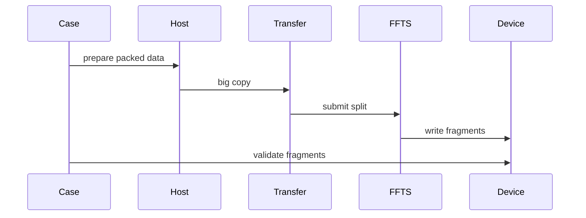
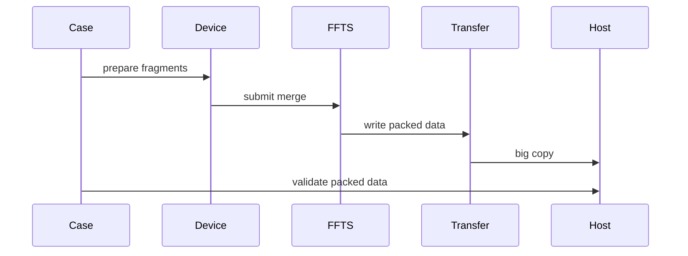
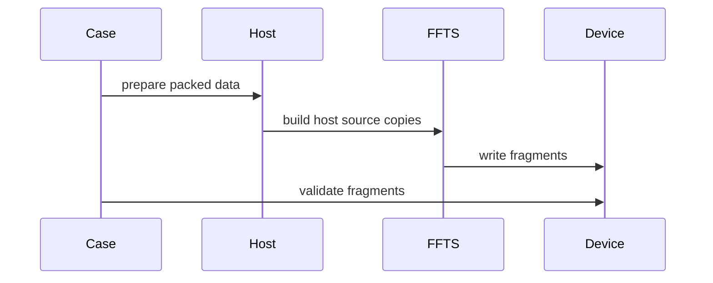
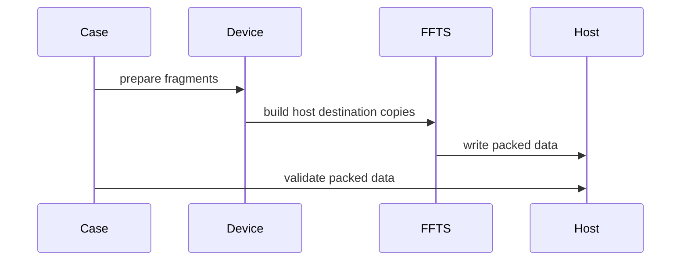

# FFTS Host Direct H2D/D2H 试验方案

## 背景

当前 Ascend FFTS H2D/D2H 路径是两段式 pipeline：

- H2D：Host 连续大块先通过 CE 拷到连续 device transfer buffer，再由 FFTS split 到多个离散 device fragment。
- D2H：多个离散 device fragment 先由 FFTS merge 到连续 device transfer buffer，再通过 CE 拷回 Host 连续大块。

对应代码位置：

`@module/copy/ascend/copy_instance_ffts_pipeline_ascend.h`

`@module/copy/ascend/copy_case_ffts_d2d_ascend.cc`

`@module/copy/ascend/ffts_d2d_dispatcher_ascend.h`

这个设计验证的是“大 IO 聚合 + device 内 split/merge”。现在想试的“一段式”不是继续做大 IO 聚合，而是把 host 地址直接写进 FFTS SDMA context，让 FFTS task 直接完成 Host 与离散 device fragment 之间的数据搬运。

## 试验目标

新增两条实验路径：

- Direct H2D：Host packed buffer 直接到 fragmented device buffers。
- Direct D2H：fragmented device buffers 直接到 Host packed buffer。

目标是回答三个问题：

1. FFTS SDMA context 能不能直接使用 Host 地址。
2. 如果能使用，FFTS SDMA 需要原始 `aclrtMallocHost` Host 地址，还是需要 `aclrtHostRegister` 或 `aclrtHostRegisterV2` 映射后的 device pointer。
3. 去掉中间 device transfer buffer 后，整体时延和带宽相对现有两段式 pipeline 是否更好。

## 关键判断

当前 dispatcher 只把传入的源地址和目的地址拆成 SDMA context 的 64 位地址字段，没有显式传递 host/device 地址空间类型。

`@module/copy/ascend/ffts_d2d_dispatcher_ascend.h`

`rtFftsPlusTaskInfo` 里的 desc address type 只表示 descriptor buffer 在 Host 侧，不表示每个 memcpy 的 source/destination 地址空间。因此，直接把 Host 虚拟地址写入 SDMA context 是否可行，必须通过运行时实验验证，不能从当前仓库代码里静态确认。

建议把这个能力视为实验特性：先新增独立 direct case，不替换现有 pipeline case。

## 当前两段式路径

H2D 现状：



D2H 现状：



现有路径的优点是 Host 与 Device 之间只有一次连续大 copy，缺点是多了一块中间 device transfer buffer，并且物理搬运量包含 Host/Device copy 和 device 内部 split/merge 两部分。

## 一段式 Direct 路径

Direct H2D：



Direct D2H：



Direct 路径的变化：

- 不创建 device transfer buffer。
- 不提交 `aclrtMemcpyAsync` 作为 H2D/D2H 大 copy。
- 仍然构造 `ctx.num` 个 FFTS SDMA copy descriptor。
- H2D descriptor 使用 `src[i]` 的 Host offset 作为源地址，使用 `dst[i]` 的 device fragment 作为目的地址。
- D2H descriptor 使用 `src[i]` 的 device fragment 作为源地址，使用 `dst[i]` 的 Host offset 作为目的地址。
- 一次 copy iteration 只提交一次 FFTS launch。

需要注意：如果目标仍然是离散 device fragments，那么 Direct 路径不是“一笔大 H2D/D2H”，而是“一次 FFTS task 描述 N 个 Host/Device SDMA copy”。它省掉了中间 transfer buffer 和二次搬运，但也失去了当前 pipeline 的大 IO 聚合语义。

## 建议新增 Case

保留现有 case：

- `ascend_h2d_ffts_split`
- `ascend_ffts_merge_d2h`

新增 direct case：

- `ascend_h2d_ffts_direct`
- `ascend_ffts_d2h_direct`

同时保留两种 mapped host 版本，便于第一轮 smoke 直接区分普通 pinned host 地址、`aclrtHostRegister` mapped device pointer 和 `aclrtHostRegisterV2` mapped device pointer：

- `ascend_reg_h2d_ffts_direct`
- `ascend_ffts_d2h_reg_direct`
- `ascend_regv2_h2d_ffts_direct`
- `ascend_ffts_d2h_regv2_direct`

对应 buffer：

`@module/copy/ascend/copy_buffer_ascend.h`

`HostCopyBuffer` 来自 `aclrtMallocHost`，direct path 传原始 Host 地址。`MallocHostRegisterCopyBuffer` 来自 `aclrtMallocHost`，再调用 `aclrtHostRegister` 取得 mapped device pointer，direct path 传 mapped device pointer。`MallocHostRegisterV2CopyBuffer` 来自 `aclrtMallocHost`，再调用 `aclrtHostRegisterV2` 和 `aclrtHostGetDevicePointer` 取得 mapped device pointer，direct path 传 mapped device pointer。

## 建议新增 CopyInstance

建议新增独立头文件，隔离实验代码：

`@module/copy/ascend/copy_instance_ffts_host_direct_ascend.h`

新增类：

- `H2DFFTSDirectCopyInstance`
- `FFTSDirectD2HCopyInstance`

也可以复用现有 `FftsPipelineCopyInstanceBase` 的计时逻辑，但要把 transfer buffer 相关成员拆出去。为了改动最小，建议新增一个轻量 base：

- 保存 device id、size、number、total bytes。
- 创建 stream 和 event。
- 保存 `fftsCopies` 和 dispatcher。
- 提供一次 FFTS launch 的测量逻辑。

H2D direct 的 prepare 逻辑：

- source 是 Host buffer。
- destination 是 fragmented device buffer。
- 为每个 fragment 构造一条 copy spec。
- 每条 copy spec 的 source 是 Host packed buffer 对应 offset。
- 每条 copy spec 的 destination 是 device fragment 地址。

D2H direct 的 prepare 逻辑：

- source 是 fragmented device buffer。
- destination 是 Host buffer。
- 为每个 fragment 构造一条 copy spec。
- 每条 copy spec 的 source 是 device fragment 地址。
- 每条 copy spec 的 destination 是 Host packed buffer 对应 offset。

## Dispatcher 调整

当前 `AscendD2DCopySpec` 名字带 D2D，但结构本身只有 destination、source、size 三个字段。为了 direct 语义更清楚，建议做一个低风险重命名：

- 新增 `AscendFftsCopySpec`。
- 让 D2D 和 direct case 都使用这个通用 spec。
- 如果想进一步控制改动，可以先保留 `AscendD2DCopySpec` 名字，只在 direct instance 里复用它，待实验通过后再统一重命名。

首轮不改 SDMA context 字段，只替换传入 SDMA context 的地址形态。普通 direct case 传 Host 地址，register 和 registerV2 direct case 传 mapped device pointer。

## Host 地址实验矩阵

第一轮只跑小规模 smoke，避免失败时影响大任务：

| 编号 | Host buffer | 方向 | 目的 |
| --- | --- | --- | --- |
| A | `HostCopyBuffer` | H2D direct | 验证 `aclrtMallocHost` 地址能否作为 FFTS source |
| B | `HostCopyBuffer` | D2H direct | 验证 `aclrtMallocHost` 地址能否作为 FFTS destination |
| C | `MallocHostRegisterCopyBuffer` | H2D direct | 验证 `aclrtHostRegister` 输出的 mapped device pointer 能否作为 FFTS source |
| D | `MallocHostRegisterCopyBuffer` | D2H direct | 验证 `aclrtHostRegister` 输出的 mapped device pointer 能否作为 FFTS destination |
| E | `MallocHostRegisterV2CopyBuffer` | H2D direct | 验证 `aclrtHostRegisterV2` 加 `aclrtHostGetDevicePointer` 输出的 mapped device pointer 能否作为 FFTS source |
| F | `MallocHostRegisterV2CopyBuffer` | D2H direct | 验证 `aclrtHostRegisterV2` 加 `aclrtHostGetDevicePointer` 输出的 mapped device pointer 能否作为 FFTS destination |

如果 A/B 通过，可以优先保留 `HostCopyBuffer` 版本。如果 A/B 失败但 C/D 或 E/F 通过，则后续正式 direct case 应明确使用 mapped device pointer，而不是普通 Host 地址。

## 正确性验证

H2D direct：

1. Host packed buffer 按 fragment offset 写入 pattern。
2. Direct FFTS task 完成后，逐个回读 fragmented device buffer。
3. 每个 device fragment 与对应 Host pattern 比较。

D2H direct：

1. 每个 fragmented device source 写入 pattern。
2. Direct FFTS task 完成后，直接检查 Host packed buffer 每个 fragment offset。
3. 每个 Host offset 与对应 device fragment pattern 比较。

校验仍放在 case 层，不计入 copy 计时。

## 计时语义

Direct case 的 `Submit(us)`：

- 只包含 Host 侧构造 FFTS descriptor 和提交 FFTS launch 的时间。
- 不再包含 `aclrtMemcpyAsync` 提交时间。

Direct case 的 `Copy(us)`：

- 用同一个 stream 上的 event 统计一次 FFTS task 的执行时间。
- H2D direct 表示 N 个 Host 到 Device SDMA copy 的完成时间。
- D2H direct 表示 N 个 Device 到 Host SDMA copy 的完成时间。

带宽仍按有效 payload 计算：

```text
payload = ctx.size * ctx.num
```

对比时不要把 Direct 与现有 pipeline 解释成同一种物理搬运模型。现有 pipeline 是大 H2D/D2H 加 device 内 split/merge；Direct 是 FFTS 直接描述 Host/Device fragment copy。

## 推荐运行

最小 smoke：

```text
copy -t ascend_h2d_ffts_direct -s 2K -n 4 -i 3 -d 1
copy -t ascend_ffts_d2h_direct -s 2K -n 4 -i 3 -d 1
copy -t ascend_reg_h2d_ffts_direct -s 2K -n 4 -i 3 -d 1
copy -t ascend_ffts_d2h_reg_direct -s 2K -n 4 -i 3 -d 1
copy -t ascend_regv2_h2d_ffts_direct -s 2K -n 4 -i 3 -d 1
copy -t ascend_ffts_d2h_regv2_direct -s 2K -n 4 -i 3 -d 1
```

如果 smoke 通过，再做中等规模：

```text
copy -t ascend_h2d_ffts_direct -s 37K -n 100 -i 64 -d 1
copy -t ascend_ffts_d2h_direct -s 37K -n 100 -i 64 -d 1
```

和现有 pipeline 对比：

```text
copy -t ascend_h2d_ffts_split -s 37K -n 100 -i 64 -d 1
copy -t ascend_ffts_merge_d2h -s 37K -n 100 -i 64 -d 1
copy -t host_to_device_ce -s 37K -n 100 -i 64 -d 1
```

## 成功标准

Direct H2D 成功需要同时满足：

- FFTS launch 返回成功。
- stream 同步返回成功。
- fragmented device buffer 校验通过。

Direct D2H 成功需要同时满足：

- FFTS launch 返回成功。
- stream 同步返回成功。
- Host packed buffer 校验通过。

性能上需要分别看：

- Direct 是否比现有 pipeline 少一次搬运后更快。
- Direct 是否因为 Host/Device fragment copy 无法形成大 IO 而低于现有 pipeline。
- `Submit(us)` 是否体现单次 FFTS launch 的优势。

## 风险与回退

主要风险：

- FFTS SDMA context 可能只支持 device address，不支持 Host virtual address。
- `aclrtMallocHost` 地址可能可用于 CE，但不一定可用于 FFTS SDMA。
- mapped device pointer 虽然是 device 可访问地址，但官方内存管理 API 说明它不能用于普通内存复制操作，因此 FFTS SDMA 仍可能拒绝。
- 失败形态可能是 launch 返回错误、stream 同步错误、数据 mismatch，极端情况下可能出现任务长时间不返回。

回退策略：

- 保留现有 `ascend_h2d_ffts_split` 和 `ascend_ffts_merge_d2h`。
- Direct case 单独注册，不影响现有 pipeline 和 CE baseline。
- 第一轮只跑小规模 smoke，必要时给外层执行脚本加超时。
- 如果 Host 地址不可用，结论应记录为 FFTS 当前封装只验证 device 内 SDMA，不继续强行替换 pipeline。

## 实施顺序

1. 新增 host direct copy instance。
2. 在 FFTS case 文件中注册 direct H2D/D2H case。
3. 先使用 `HostCopyBuffer` 跑最小 smoke。
4. 同时使用 register 和 registerV2 direct case 跑 mapped device pointer smoke。
5. smoke 通过后，再扩展实验脚本，把 direct case 加入 H2D 对比矩阵。
6. 根据 Direct 与现有 pipeline 的结果决定是否保留为正式 case，还是只保留为实验 case。

## 结论预期

这个方向值得试，但要把预期放准：它验证的是 FFTS 能否直接搬 Host 地址，并尝试用一次 FFTS launch 消除中间 transfer buffer；它不是当前“大 H2D/D2H 聚合”方案的等价替换。

如果 Host 地址被 FFTS SDMA 接受，Direct 路径可能在中小 fragment 数下减少一次 device 内搬运并降低端到端耗时。如果 Host 地址不被接受，现有两段式 pipeline 仍是更稳的路径，因为它把 FFTS 使用范围限制在已验证的 device 内 copy。
