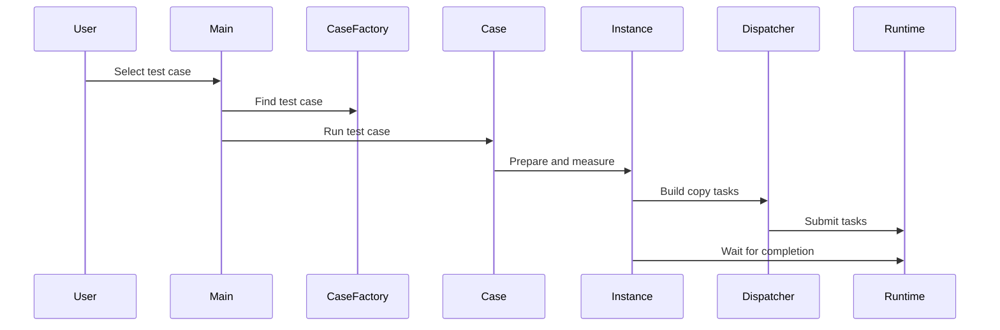
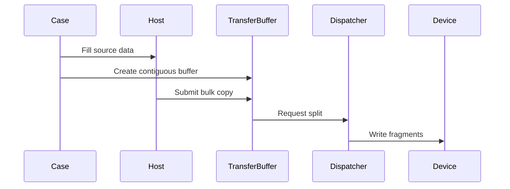

# 昇腾 FFTS 拷贝实例代码路径梳理

这份文档按“C++ 基础还不熟也能顺着读”的方式梳理昇腾 copy 后端里的 FFTS instance 路径。先看大图，再看每个类承担什么职责，最后再看三类 FFTS copy instance 的差异。

## 先抓住主线

这套代码的运行主线是：

1. `copy` 命令解析参数，得到要运行的 case 名称、单个 fragment 大小、fragment 数量、迭代次数和设备数量。
2. `CopyCaseFactory` 根据 case 名称找到已经注册好的 case。
3. case 创建源 buffer 和目标 buffer，必要时填充测试数据。
4. case 创建一个具体的 copy instance。
5. copy instance 统一执行 `Prepare`、预热、多轮 `DoCopyOnce`、`Cleanup`。
6. FFTS instance 把一批拷贝请求整理成 copy spec。
7. dispatcher 把 copy spec 转成 FFTS SDMA context，再提交给 Ascend runtime。

对应文件：

`@module/copy/copy_main.cc`

`@module/copy/copy_case.h`

`@module/copy/copy_instance.h`

`@module/copy/ascend/copy_case_ffts_d2d_ascend.cc`

`@module/copy/ascend/ffts_d2d_dispatcher_ascend.h`



图里的真实代码入口和函数名在下面正文里展开。图里只保留角色关系，避免把源码符号塞进时序图导致阅读困难。

## 编译时先决定有没有 FFTS case

Ascend copy 后端里的普通 Ascend copy 代码总是可以按 Ascend 后端参与编译，但 FFTS case 额外依赖 FFTS runtime header 和 `libruntime`。

构建逻辑大致是：

- 先检测 Ascend runtime。
- 再检测 FFTS header 和 runtime library。
- 如果检测成功，就把 FFTS case 文件加入 `copy` 目标。
- 如果检测失败，就跳过 FFTS case，普通 Ascend copy case 仍然存在。

对应文件：

`@cmake/DetectRuntime.cmake`

`@module/copy/CMakeLists.txt`

这点很重要：如果运行 `copy -t ascend_h2d_ffts_split` 找不到 case，不一定是 case 注册代码坏了，也可能是编译时根本没把 FFTS case 编进 binary。

## C++ 上的几个读法

读这段代码时，先记住几个 C++ 机制：

- `class 子类 : public 父类` 表示继承。子类可以复用父类逻辑，也可以改写父类留出来的虚函数。
- `virtual` 和 `override` 是多态入口。父类的流程里调用虚函数时，实际会进入子类实现。
- `std::vector` 可以先理解成“动态数组”。这里常用来保存一批地址、一批 stream context、一批 FFTS context。
- `std::unique_ptr` 表示独占拥有一个对象。pipeline 路径用它持有中转 device buffer，清理时自动释放对象。
- `DEFINE_COPY_CASE` 是宏。它展开后会生成一个 case 类，并用静态 registrar 把这个 case 注册到工厂里。

对应文件：

`@module/copy/copy_case.h`

`@module/copy/copy_instance.h`

## case 是怎么被 main 找到的

主入口只认识命令行参数和 `CopyCaseFactory`，它不直接 new 某个 FFTS case。

真正的注册发生在 `DEFINE_COPY_CASE` 宏里。每个 case 文件写一个 `DEFINE_COPY_CASE`，宏会生成一个 case 类，并创建一个全局静态 registrar。程序启动时，这些 registrar 会把 case 对象放进 `CopyCaseFactory`。

所以路径是：

1. 源文件被编进 binary。
2. 静态 registrar 在程序启动阶段完成注册。
3. main 根据 `-t` 参数去 factory 里过滤 case。
4. 找到 case 后调用 case 的 `Run`。

对应文件：

`@module/copy/copy_main.cc`

`@module/copy/copy_case.h`

`@module/copy/ascend/copy_case_ffts_d2d_ascend.cc`

## CopyInstance 是统一测量框架

`CopyInstance` 是所有 copy instance 的共同父类。它不是具体的 Ascend 或 FFTS 实现，而是规定一套测量流程：

1. `Prepare` 准备资源，比如 stream、event、临时 buffer、copy spec。
2. 先跑几轮 warmup。
3. 正式跑 `iterations` 轮。
4. 每轮调用 `DoCopyOnce`。
5. 收集每轮 submit 时间和 copy 时间。
6. `Cleanup` 释放资源。
7. 返回 `CopyResult::Result`。

这就是典型的模板方法模式：父类固定外层流程，子类只填里面几个关键动作。

对应文件：

`@module/copy/copy_instance.h`

`@module/copy/copy_result.h`

## buffer 先理解成地址集合

`CopyBuffer` 里最重要的三个概念是：

- `device`：这个 buffer 属于哪个 device。
- `size`：单个 fragment 的字节数。
- `number`：有多少个 fragment。

`buffer[i]` 会返回第 `i` 个 fragment 的地址。不同 buffer 子类的差异主要在于地址怎么分配、地址是否连续。

常见 buffer：

- `HostCopyBuffer`：用 Ascend host allocation 分配一块连续 host 内存。
- `DeviceCopyBuffer`：用 Ascend device allocation 分配一块连续 device 内存。
- `FragmentedDeviceCopyBuffer`：每个 fragment 都单独分配一块 device 内存。
- `MallocHostRegisterCopyBuffer`：host 内存注册后，把 mapped device pointer 暴露给 `buffer[i]`。
- `MallocHostRegisterV2CopyBuffer`：使用 V2 注册接口和获取 device pointer 的接口，再把 mapped device pointer 暴露给 `buffer[i]`。

对应文件：

`@module/copy/copy_buffer.h`

`@module/copy/ascend/copy_buffer_ascend.h`

注意：case 层做 CPU 侧初始化和校验时，registered host buffer 不能直接用 mapped device pointer 访问 CPU 数据，所以代码里有 `HostAddress` 辅助函数。它会识别 registered buffer，并返回真正的 host pointer。

## AscendCopyInstanceBase 负责普通 Ascend 测量骨架

`AscendCopyInstanceBase` 是普通 Ascend copy instance 的基类，也被纯 D2D FFTS instance 复用。

它在 `Prepare` 里做这些事：

- 检查源 buffer 和目标 buffer 的 fragment 数量、大小是否一致。
- 选择 affinity device。
- 创建 stream。
- 创建 event。
- 把每个 fragment 的源地址和目标地址保存到 `AscendStreamContext`。

它在 `DoCopyOnce` 里做这些事：

- 记录总 start event。
- 调用子类的 `CopyInternal` 提交真正的 copy。
- 记录其它 stream 的 end event。
- 记录总 end event。
- 调用子类的 `SynchronizeInternal` 等待完成。
- 用 event elapsed time 算 copy 时间。

对应文件：

`@module/copy/ascend/copy_instance_ascend.h`

关键点：`AscendCopyInstanceBase` 不关心子类是 CE 还是 FFTS，它只管 stream、event 和测量边界。真正提交什么任务，由子类的 `CopyInternal` 决定。

## FFTS instance 第一类：纯 D2D

纯 D2D FFTS 路径使用 `D2DFFTSCopyInstance`。

它复用了 `AscendCopyInstanceBase` 的测量骨架，只改写两个动作：

- `CopyInternal`：把 `ctx.src` 和 `ctx.dst` 逐个配对，生成一批 copy spec，然后交给 dispatcher。
- `SynchronizeInternal`：同步当前 stream。

对应文件：

`@module/copy/ascend/copy_instance_ffts_ascend.h`

纯 D2D 有两个 case：

- `ascend_d2d_merge_ffts`：源是 fragmented device buffer，目标是连续 device buffer。
- `ascend_d2d_split_ffts`：源是连续 device buffer，目标是 fragmented device buffer。

对应文件：

`@module/copy/ascend/copy_case_ffts_d2d_ascend.cc`

这里容易误解的一点是：`D2DFFTSCopyInstance` 自己并不知道“merge”或者“split”。它只是把第 `i` 个源地址拷到第 `i` 个目标地址。merge 还是 split，是由 case 选择的 buffer 形态决定的。

## FFTS instance 第二类：两段式 pipeline

两段式 pipeline 用来把 host 和 fragmented device 之间的批量小拷贝，改写成“大 CE 拷贝加一次 FFTS device 内部搬运”。

它有一个共同基类 `FftsPipelineCopyInstanceBase`，这个基类自己继承 `CopyInstance`，不继承 `AscendCopyInstanceBase`。原因是它的流程不是简单的一批同类 copy，而是要在一个 stream 里串起 CE 和 FFTS 两段动作。

共同准备逻辑包括：

- 选择 device。
- 保存 fragment 大小和数量。
- 计算总字节数。
- 创建一个连续的 device transfer buffer。
- 创建 stream 和 event。
- 保存 FFTS copy spec。
- 持有 dispatcher。

对应文件：

`@module/copy/ascend/copy_instance_ffts_pipeline_ascend.h`

### H2D split pipeline

case 名称是 `ascend_h2d_ffts_split`。

数据方向是：

```text
host 连续大块 -> device 连续中转区 -> device 碎片区
```

执行顺序是：

1. case 创建 `HostCopyBuffer` 和 `FragmentedDeviceCopyBuffer`。
2. case 把 pattern 写入 host 连续大块。
3. instance 创建 device transfer buffer。
4. instance 为每个 fragment 生成一条 copy spec，方向是 transfer fragment 到 device fragment。
5. 每轮先提交一次大 H2D。
6. 再提交一次 FFTS，把中转区拆到碎片区。
7. 同步 stream 后统计整条 pipeline 时间。



### D2H merge pipeline

case 名称是 `ascend_ffts_merge_d2h`。

数据方向是：

```text
device 碎片区 -> device 连续中转区 -> host 连续大块
```

执行顺序是：

1. case 创建 `FragmentedDeviceCopyBuffer` 和 `HostCopyBuffer`。
2. case 把 pattern 写入 device 碎片区。
3. instance 创建 device transfer buffer。
4. instance 为每个 fragment 生成一条 copy spec，方向是 device fragment 到 transfer fragment。
5. 每轮先提交 FFTS，把碎片合到中转区。
6. 再提交一次大 D2H。
7. 同步 stream 后统计整条 pipeline 时间。

这两个 pipeline 的核心区别只有方向不同：H2D split 是先大 H2D 再 FFTS，D2H merge 是先 FFTS 再大 D2H。

## FFTS instance 第三类：host direct

host direct 路径去掉了中间的 device transfer buffer。它把 host 侧地址和 fragmented device 地址直接写进 FFTS copy spec。

对应文件：

`@module/copy/ascend/copy_instance_ffts_host_direct_ascend.h`

host direct 有两种方向：

- `H2DFFTSDirectCopyInstance`：每条 spec 表示 host fragment 到 device fragment。
- `FFTSDirectD2HCopyInstance`：每条 spec 表示 device fragment 到 host fragment。

case 层有普通 host、registered host、registered V2 host 几组入口。普通 host 传入的是原始 host pointer；registered 版本传入的是 mapped device pointer。

对应文件：

`@module/copy/ascend/copy_case_ffts_d2d_ascend.cc`

`@module/copy/ascend/copy_buffer_ascend.h`

这条路径能否真正跑通，不只取决于本仓代码，还取决于 Ascend runtime 和硬件是否允许 FFTS SDMA context 直接使用这种 host 地址形态。

## dispatcher 真正把 instance 接到 FFTS runtime

`FftsD2DDispatcher` 是 FFTS 路径最核心的转换层。上层 instance 只给它一批 copy spec，每条 spec 只有三个信息：目标地址、源地址、大小。

dispatcher 做四件事：

1. `AddMemcpy` 把一条 copy spec 转成一个 FFTS SDMA context。
2. `BuildCopies` 把一批 context 按 ready lane 组织起来。
3. `AddDependency` 给同一条 lane 后面的 context 增加前驱依赖。
4. `Launch` 构造 FFTS Plus task 信息并提交 runtime。

对应文件：

`@module/copy/ascend/ffts_d2d_dispatcher_ascend.h`

`AddMemcpy` 这个名字容易误导。它不是立刻执行 memcpy，而是“增加一条将来由 FFTS 执行的 SDMA 描述”。真正提交发生在 `Launch`。

## ready lane 怎么理解

FFTS Plus task 里可能有很多 SDMA context。如果全部一次性设为 ready，runtime 看到的是一大批可同时开始的任务。当前 dispatcher 采用 lane 方式限制初始 ready 数量：

- 默认最多 8 条 ready lane。
- 每个 copy spec 生成一个 context。
- context 按轮询方式分配到 lane。
- 同一条 lane 内，后一个 context 依赖前一个 context。
- 初始 ready context 数等于 lane 数。

这样可以让 task 内部保留一定并发，但又不会把所有 context 都作为初始 ready 任务抛给 runtime。

lane 数也可以通过环境变量调整：

```text
FFTS_MAX_READY_LANES
```

对应文件：

`@module/copy/ascend/ffts_d2d_dispatcher_ascend.h`

## 一次 FFTS instance 的执行可以这样读

以 `ascend_h2d_ffts_split` 为例，从上往下读：

1. 主入口解析 `-t ascend_h2d_ffts_split`。
2. `CopyCaseFactory` 找到对应 case。
3. case 创建 host 源 buffer 和 fragmented device 目标 buffer。
4. case 创建 `H2DFFTSSplitCopyInstance`。
5. `CopyInstance::DoCopy` 进入统一测量流程。
6. `Prepare` 创建中转 device buffer、stream、event，并准备 FFTS copy spec。
7. warmup 和正式迭代都会调用 `DoCopyOnce`。
8. 每轮先提交大 H2D，再让 dispatcher 提交 FFTS split。
9. stream 同步后，event 时间作为 copy 时间，提交侧耗时作为 submit 时间。
10. case 根据环境变量决定是否校验结果。
11. `CopyResult` 汇总并打印表格。

对应文件：

`@module/copy/copy_main.cc`

`@module/copy/copy_case.h`

`@module/copy/copy_instance.h`

`@module/copy/ascend/copy_case_ffts_d2d_ascend.cc`

`@module/copy/ascend/copy_instance_ffts_pipeline_ascend.h`

`@module/copy/ascend/ffts_d2d_dispatcher_ascend.h`

`@module/copy/copy_result.h`

## 建议阅读顺序

如果 C++ 基础还不熟，建议按这个顺序读：

1. 先读主入口文件，确认命令行如何进入 case。
2. 再读 case 注册文件，理解 case 注册宏和 factory。
3. 再读 instance 基类文件，理解统一测量流程。
4. 再读 buffer 基类和 Ascend buffer 文件，理解 `buffer[i]` 到底返回什么地址。
5. 再读 FFTS case 文件，看每个 case 创建了什么 buffer 和 instance。
6. 再读三个 FFTS instance 头文件，看每类 instance 如何生成 copy spec。
7. 最后读 dispatcher 文件，看 copy spec 如何变成 FFTS context 并 launch。

对应文件：

`@module/copy/copy_main.cc`

`@module/copy/copy_case.h`

`@module/copy/copy_instance.h`

`@module/copy/copy_buffer.h`

`@module/copy/ascend/copy_buffer_ascend.h`

`@module/copy/ascend/copy_case_ffts_d2d_ascend.cc`

`@module/copy/ascend/copy_instance_ffts_ascend.h`

`@module/copy/ascend/copy_instance_ffts_pipeline_ascend.h`

`@module/copy/ascend/copy_instance_ffts_host_direct_ascend.h`

`@module/copy/ascend/ffts_d2d_dispatcher_ascend.h`

## 最容易混的几个点

`AddMemcpy` 不是执行拷贝，只是添加 FFTS SDMA context。

`D2DFFTSCopyInstance` 不主动区分 merge 和 split，merge 或 split 由 case 选择的 buffer 形态决定。

pipeline 路径有中转 device buffer，host direct 路径没有中转 device buffer。

registered host buffer 有两类地址：CPU 初始化和校验用 host pointer，FFTS direct spec 用 mapped device pointer。

`Submit(us)` 统计的是主机侧提交任务的时间，`Copy(us)` 统计的是 stream 上从 start event 到 end event 的时间。

是否有 FFTS case，取决于编译时是否检测到 FFTS runtime 相关头文件和库。
