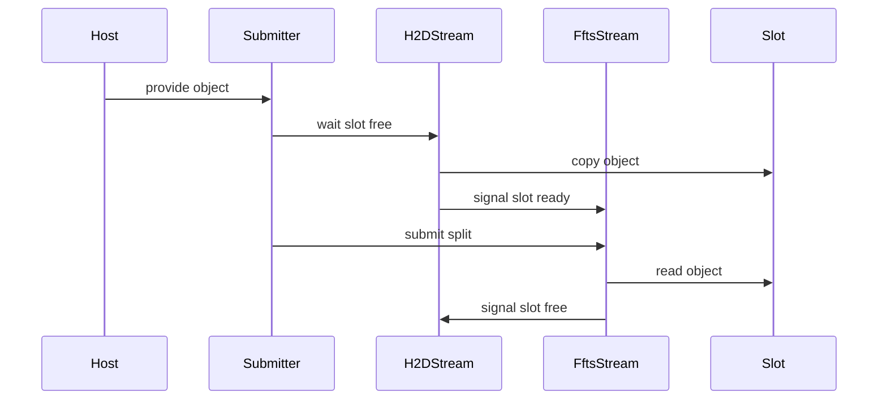
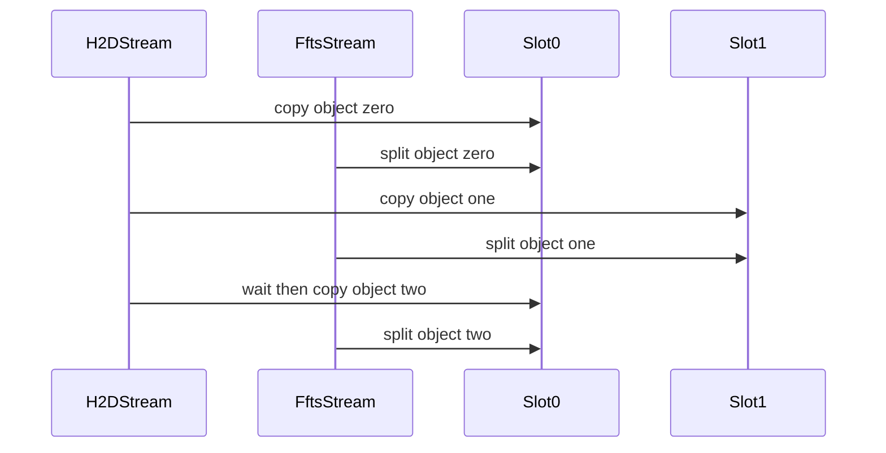

# 在 copy case 中实现 Yuanrong H2D 双缓冲流水线方案

这份文档说明如何在 dev-sandbox 的 Ascend copy case 里实现一个参考 yuanrong 的 H2D pipeline。它不是要把 yuanrong 的 DataSystem 代码搬过来，而是把它最关键的流水线结构移植到 copy benchmark：一段大 H2D 写入 device 中转 slot，另一段 FFTS 把中转 slot 拆到多个 fragmented device buffer，并通过双缓冲让相邻 object 的两段工作重叠。

## 先说结论

建议新增一个 case，不替换现有 `ascend_h2d_ffts_split`。

新 case 名称建议：

```text
ascend_h2d_ffts_yuanrong_pipeline
```

新 instance 名称建议：

```text
H2DFFTSYuanrongPipelineCopyInstance
```

建议先放在现有 FFTS pipeline 头文件里，因为它和当前 H2D split 共享同一类资源和 dispatcher：

`@dev-sandbox/module/copy/ascend/copy_instance_ffts_pipeline_ascend.h`

case 注册放在：

`@dev-sandbox/module/copy/ascend/copy_case_ffts_d2d_ascend.cc`

现有 baseline 保持不变：

```text
ascend_h2d_ffts_split
```

这样后面能直接比较三条路径：

- CE：多个 fragment 各自 H2D。
- 现有 H2D FFTS split：一次大 H2D，然后一次 FFTS split。
- Yuanrong pipeline：多个 logical object 轮流走 H2D slot 和 FFTS split，形成双缓冲重叠。

## 先明确目标边界

yuanrong 的核心模型是：

```text
host object -> device staging slot -> device blobs
```

当前 copy benchmark 的模型是：

```text
packed host buffer -> device transfer buffer -> fragmented device buffers
```

两者可以对应起来：

- `HostCopyBuffer` 是一块连续 host 数据。
- `FragmentedDeviceCopyBuffer` 是最终的多个 device blob。
- `DeviceCopyBuffer` 可以作为 device staging slot。
- 一个 logical object 可以对应一段连续 host 数据，以及这段数据要拆到的若干个 fragmented device buffer。

这里最关键的一点是：当前 `ascend_h2d_ffts_split` 的一次 `DoCopyOnce` 只有一个大 object。如果只是加两个 stream 和两个 slot，但每轮只提交一个 object，基本不会形成真正的流水线。为了复刻 yuanrong 的重叠效果，需要把 `ctx.num` 个 fragment 切成多个 logical object/group。

例如：

```text
ctx.size = 37K
ctx.num = 1024
object_frags = 8
```

那么一次 benchmark iteration 内有 128 个 logical object。每个 object 是 8 个连续 fragment 的 host 数据，先做一笔大小为 `37K * 8` 的 H2D，再用 FFTS split 到 8 个目标 fragmented device buffer。

## Yuanrong 参考点

yuanrong 里真正值得移植的是这几个点：

- pipeline depth 固定为 2。
- H2D 和 FFTS 使用两条 stream。
- 每个 device staging slot 有两类同步信号。
- H2D stream 只能写已经空闲的 slot。
- FFTS stream 只能读已经完成 H2D 的 slot。
- FFTS 完成后释放 slot，供后续 H2D 复用。

对应 yuanrong 代码位置：

`@yuanrong-datasystem/src/datasystem/common/device/ascend/acl_resource_manager.h`

`@yuanrong-datasystem/src/datasystem/common/device/ascend/acl_resource_manager.cpp`

在 dev-sandbox 里不建议第一版直接使用 runtime notify。当前 copy 模块已有 `aclrtEvent` 和 `aclrtStreamWaitEvent` 的使用方式，第一版用 event 模拟 yuanrong 的 `toPinDone` 和 `toDestDone` 更稳。

## 推荐的数据模型

新增一个轻量 object 描述结构：

```cpp
struct PipelineObjectRange {
    size_t firstFragment;
    size_t fragmentCount;
    size_t bytes;
};
```

它表示一个 logical object：

- `firstFragment`：这个 object 从第几个 fragment 开始。
- `fragmentCount`：这个 object 包含几个 fragment。
- `bytes`：这个 object 的 H2D 大小，也就是 `fragmentCount * size_`。

按 `COPY_FFTS_PIPELINE_OBJECT_FRAGS` 控制每个 object 包含多少 fragment。建议默认值为 8。

```text
COPY_FFTS_PIPELINE_OBJECT_FRAGS=8
```

如果环境变量没有设置，就使用 8；如果大于 `number_`，就裁剪到 `number_`；最后一组不够 8 个 fragment 时按实际数量提交。

这个参数不要和 `FFTS_MAX_READY_LANES` 混在一起：

- `COPY_FFTS_PIPELINE_OBJECT_FRAGS` 控制一个 logical object 有多大。
- `FFTS_MAX_READY_LANES` 控制一个 object 内部 FFTS split 的 ready lane 数。

## 新 instance 的资源设计

新增 instance 可以继承 `CopyInstance`，也可以拆一个新 base。为了改动最小，建议先继承 `CopyInstance`，不要强行复用当前 `FftsPipelineCopyInstanceBase`，因为现有 base 假设只有一条 stream 和一个 transfer buffer。

新 instance 需要这些成员：

```cpp
static constexpr size_t kPipelineDepth = 2;

size_t deviceId_;
size_t size_;
size_t number_;
size_t objectFrags_;
size_t maxObjectBytes_;

aclrtStream h2dStream_;
aclrtStream fftsStream_;
aclrtEvent totalStart_;
aclrtEvent totalEnd_;
aclrtEvent slotReady_[kPipelineDepth];
aclrtEvent slotFree_[kPipelineDepth];

std::array<std::unique_ptr<DeviceCopyBuffer>, kPipelineDepth> transferBuffers_;
std::vector<PipelineObjectRange> objects_;
FftsD2DDispatcher dispatcher_;
```

字段语义按 yuanrong 对齐：

- `h2dStream_` 对应 yuanrong 的 H2D stream。
- `fftsStream_` 对应 yuanrong 的 FFTS stream。
- `slotReady_` 对应 H2D 完成通知，语义类似 `toPinDone`。
- `slotFree_` 对应 FFTS 完成通知，语义类似 `toDestDone`。
- `transferBuffers_` 是两个 device staging slot。
- `objects_` 是当前 benchmark iteration 内要流水线提交的 logical object 列表。

## 初始化流程

`Prepare` 建议按这个顺序读和写：

1. 校验输入只有一个 src buffer 和一个 dst buffer。
2. 校验 `src.Number()`、`dst.Number()` 和 `src.Size()` 一致。
3. 根据 src 和 dst 决定 device。
4. 读取 `COPY_FFTS_PIPELINE_OBJECT_FRAGS`。
5. 根据 `number_` 切出 `objects_`。
6. 创建两条 stream。
7. 创建总计时 event。
8. 为每个 slot 创建 `slotReady_` 和 `slotFree_`。
9. 为每个 slot 分配一个 `DeviceCopyBuffer`，容量是 `size_ * objectFrags_`。
10. 先在 H2D stream 上记录两个 `slotFree_`，表示两个 slot 初始都是空闲的。

第一版不需要 host staging buffer。原因是 dev-sandbox 的 `HostCopyBuffer` 本身就是连续 host 内存，已经能表达一段 object 数据。yuanrong 的 host staging 是为 DataSystem 的 object buffer 管理服务的，不是 device 侧流水线成立的必要条件。

## 单个 object 的提交模板

单个 logical object 的提交顺序是：

```text
choose slot by object index
H2D stream waits slot free
H2D stream copies object to device slot
H2D stream records slot ready
FFTS stream waits slot ready
FFTS stream launches split from slot to destination blobs
FFTS stream records slot free
```

时序图如下，图里只放角色和动作，不放源码路径和复杂函数名：



正文里对应的真实函数建议这样拆：

- `DoCopyOnce` 负责计时、循环提交所有 object、最后等待所有 slot 结束。
- `SubmitObject` 负责一个 object 的 H2D、event 接力、FFTS split 提交。
- `BuildObjectCopies` 负责把一个 object 转成若干条 `AscendD2DCopySpec`。
- `Cleanup` 负责销毁 event、stream 和 transfer buffer。

## `DoCopyOnce` 的整体流程

建议用 H2D stream 作为计时协调 stream，做法和当前多 stream copy 类似：

1. 在 H2D stream 上记录 `totalStart_`。
2. 让 FFTS stream 等待 `totalStart_`，保证两个 stream 的工作都在计时窗口之后。
3. 记录 host submit 起点。
4. 循环 `objects_`，逐个调用 `SubmitObject`。
5. host submit 结束，得到 `Submit(us)`。
6. H2D stream 等待两个 slot 的 `slotFree_`。
7. 在 H2D stream 上记录 `totalEnd_`。
8. 同步 H2D stream。
9. 用 `aclrtEventElapsedTime` 算 `Copy(us)`。

注意第 6 步很重要。因为最后一个 FFTS split 在 FFTS stream 上，必须把它通过 `slotFree_` 汇合回 H2D stream，`totalEnd_` 才能代表整条 pipeline 完成。

## `SubmitObject` 细节

每个 object 使用 `objectIndex % 2` 选择 slot。

H2D 部分：

- host 源地址是 `src[firstFragment]`。
- device staging 目的地址是当前 slot 的首地址。
- copy 大小是 `fragmentCount * size_`。
- 使用 `ACL_MEMCPY_HOST_TO_DEVICE`。

FFTS 部分：

- 当前 slot 内的第 0 个 fragment 对应目标 `dst[firstFragment]`。
- 当前 slot 内的第 1 个 fragment 对应目标 `dst[firstFragment + 1]`。
- 依次类推。
- 每个目标 fragment 生成一条 `AscendD2DCopySpec`。
- 每个 object 单独调用 `dispatcher_.BuildCopies` 和 `dispatcher_.Launch`。

第一版建议每个 object 一个 FFTS launch。这样最容易对齐 yuanrong 的 object 语义，也能复用当前 `FftsD2DDispatcher` 的 reset 和 dependency 逻辑。后面如果想减少 launch 次数，再考虑把多个 object 合成一个更大的 FFTS task，但那会让 slot 生命周期更复杂。

## 双缓冲如何产生重叠

假设有三个 object，pipeline depth 是 2：

```text
object 0 uses slot 0
object 1 uses slot 1
object 2 uses slot 0 again
```

时序大致是：



这个图只表达重叠关系，真实约束是由 `slotReady_` 和 `slotFree_` 保证的。H2D stream 可以在 slot 1 上提交下一个 object，同时 FFTS stream 在 slot 0 上处理上一个 object；当 H2D 要回到 slot 0 时，必须先等 slot 0 被 FFTS 释放。

## copy case 改动点

在 case 文件里新增一个环境变量读取函数：

```text
ReadFftsPipelineObjectFrags
```

它只负责把 `COPY_FFTS_PIPELINE_OBJECT_FRAGS` 转成正整数。解析失败时建议使用默认值 8，不要让 benchmark 因为一个 env 拼写错误直接崩掉；但可以在输出里打印实际值，方便看日志。

新增 case 的主体和当前 H2D split 类似：

1. 创建 `HostCopyBuffer`。
2. 创建 `FragmentedDeviceCopyBuffer`。
3. 写入 host pattern。
4. 清零目标 device buffer。
5. 创建 `H2DFFTSYuanrongPipelineCopyInstance`。
6. 运行 `DoCopy`。
7. 如果开启 `COPY_FFTS_VALIDATE`，复用现有 device validation。

代码位置：

`@dev-sandbox/module/copy/ascend/copy_case_ffts_d2d_ascend.cc`

## 和当前代码的对应阅读路径

如果你按 C++ 代码来读，建议这样走，不要一上来钻模板和宏：

1. 先读 case 注册。

`@dev-sandbox/module/copy/ascend/copy_case_ffts_d2d_ascend.cc`

看 `DEFINE_COPY_CASE`，确认命令行 `-t` 会进入哪个 case，以及 case 创建了什么 buffer 和 instance。

2. 再读 buffer 类型。

`@dev-sandbox/module/copy/ascend/copy_buffer_ascend.h`

确认 `HostCopyBuffer` 是连续 host 内存，`DeviceCopyBuffer` 是连续 device 内存，`FragmentedDeviceCopyBuffer` 是多个离散 device 指针。

3. 再读 instance 字段。

`@dev-sandbox/module/copy/ascend/copy_instance_ffts_pipeline_ascend.h`

先看 class 里的成员变量。读 C++ 类的时候，字段比函数体更能告诉你这个类要管理什么资源。这里重点看 stream、event、transfer buffer、object range 和 dispatcher。

4. 再读 `Prepare`。

`Prepare` 是资源和数据结构初始化的位置。你要确认 object 怎么切、slot 怎么分配、event 怎么初始化。

5. 再读 `DoCopyOnce`。

`DoCopyOnce` 是 benchmark 一次 iteration 的真实提交路径。你要确认 H2D 和 FFTS 是按 object 交错提交，还是全部 H2D 完再全部 FFTS。

6. 最后读 dispatcher。

`@dev-sandbox/module/copy/ascend/ffts_d2d_dispatcher_ascend.h`

dispatcher 的重点不是业务语义，而是把 `AscendD2DCopySpec` 变成 FFTS SDMA context、dependency 和 launch。读到这里时，只要确认每个 object 生成的 spec 数量等于这个 object 的 fragment 数量即可。

## 为什么不是直接改现有 `ascend_h2d_ffts_split`

现有 case 很适合作为 baseline：

- 它只有一次大 H2D。
- 它只有一个 device transfer buffer。
- 它只有一条 stream。
- 它能直接回答“两段式 H2D 不流水线时性能如何”。

Yuanrong pipeline case 要回答的是另一个问题：

```text
当一次 iteration 内有多个 logical object 时，H2D staging 和 FFTS split 能否通过双缓冲重叠。
```

这两个问题都很有价值，所以不要把旧 case 改掉。新增 case 更利于对比，也更容易回滚。

## 验证方案

先做 correctness，再做性能。

正确性建议：

```text
COPY_FFTS_VALIDATE=1
copy -t ascend_h2d_ffts_yuanrong_pipeline -s 37K -n 32 -i 4 -d 1
```

再加几个边界：

```text
COPY_FFTS_VALIDATE=1 COPY_FFTS_PIPELINE_OBJECT_FRAGS=1
copy -t ascend_h2d_ffts_yuanrong_pipeline -s 8K -n 16 -i 4 -d 1
```

```text
COPY_FFTS_VALIDATE=1 COPY_FFTS_PIPELINE_OBJECT_FRAGS=7
copy -t ascend_h2d_ffts_yuanrong_pipeline -s 37K -n 31 -i 4 -d 1
```

第二个命令验证 object 只有一个 fragment 时不破坏语义。第三个命令验证最后一组 fragment 不满一个 object 时也能正确。

性能对比建议：

```text
COPY_FFTS_VALIDATE=0
copy -t ascend_h2d_ffts_split -s 37K -n 1024 -i 128 -d 1
```

```text
COPY_FFTS_VALIDATE=0 COPY_FFTS_PIPELINE_OBJECT_FRAGS=8
copy -t ascend_h2d_ffts_yuanrong_pipeline -s 37K -n 1024 -i 128 -d 1
```

```text
COPY_FFTS_VALIDATE=0 COPY_FFTS_PIPELINE_OBJECT_FRAGS=16
copy -t ascend_h2d_ffts_yuanrong_pipeline -s 37K -n 1024 -i 128 -d 1
```

`object_frags` 不建议一开始扫太多。先看 1、8、16、32 就够了。`object_frags=1` 更像小 H2D 加 FFTS，`object_frags=number_` 则退化成当前单对象两段式路径，中间值才是 pipeline 主要观察区。

## 统计口径

`Submit(us)` 应表示 host 侧提交整条 pipeline 的时间，包含所有 object 的 H2D、event wait、FFTS launch 提交。

`Copy(us)` 应表示一次 iteration 内整条 pipeline 从第一笔 H2D 开始，到最后一个 FFTS split 完成的 device 侧时间。

和现有 `ascend_h2d_ffts_split` 对比时要注意：

- 现有 case 的 `Copy(us)` 是一个大 H2D 加一个 FFTS split 的串行总时间。
- 新 case 的 `Copy(us)` 是多个 object 交错后的 end to end 时间。
- 两者总 bytes 都是 `size * number`，所以带宽仍然可以对比。
- 但新 case 的 object 粒度会影响 launch 次数和 overlap 程度，因此必须在日志里保留 `COPY_FFTS_PIPELINE_OBJECT_FRAGS`。

## 脚本改动建议

性能脚本增加一个可选 case：

`@dev-sandbox/module/copy/ascend/scripts/run_h2d_ffts_experiments.py`

建议新增 label：

```text
h2d_ffts_yuanrong_pipeline
```

并允许通过参数或 env 传入 object fragments。默认先用 8。

validation 脚本也要加入新 case：

`@dev-sandbox/module/copy/ascend/scripts/run_h2d_ffts_validation.py`

validation 默认矩阵可以小一些，重点覆盖：

- `object_frags=1`
- `object_frags=8`
- `object_frags` 不能整除 `num`
- 不同 `FFTS_MAX_READY_LANES`

## 分阶段落地

第一阶段：最小可跑通版本。

- 新增 `H2DFFTSYuanrongPipelineCopyInstance`。
- 新增 `ascend_h2d_ffts_yuanrong_pipeline` case。
- 支持 `COPY_FFTS_PIPELINE_OBJECT_FRAGS`。
- 使用 `aclrtEvent` 做 slot ready 和 slot free。
- 每个 object 单独 FFTS launch。
- 复用现有 validation。

第二阶段：补 benchmark 脚本。

- 实验脚本增加新 case。
- validation 脚本增加新 case。
- 输出里打印 object fragments。
- 对比 `ascend_h2d_ffts_split`、CE 和新 pipeline。

第三阶段：再考虑 yuanrong 的 host staging。

第一版不做 host staging，是因为 copy benchmark 的 host buffer 已经连续。等 device 侧 pipeline 跑通后，如果要更像 yuanrong，可以再加 host staging buffer 和 host copy worker，但那会引入 CPU 线程调度噪声，不适合作为第一版。

## 风险点

第一，只有一个 object 时不会有 pipeline overlap。必须用 `ctx.num` 切出多个 object，或者未来支持 batch 多个 src/dst buffer。

第二，event 的初始状态要处理好。两个 `slotFree_` 必须在提交第一轮 H2D 之前先 record，否则 H2D stream 第一次 wait 会等不到有效事件。

第三，最后的计时必须 join 回协调 stream。否则 `Copy(us)` 可能只测到 H2D submit，不包含最后一个 FFTS split。

第四，每个 object 都重新 `BuildCopies`，避免不同 object 的 FFTS context 混在一起。这个做法 launch 次数更多，但正确性和可读性最好。

第五，object 太小会放大 launch overhead，object 太大又接近现有串行路径。默认 `object_frags=8` 是一个保守起点，不是最终结论。

## 读代码时的抓手

你读这块 C++ 时可以始终抓住四个问题：

1. 当前这段代码处理的是一个 fragment、一个 object，还是整轮 iteration？
2. 当前指针在 host、device staging slot，还是最终 fragmented device buffer？
3. 当前 stream 是在做 H2D，还是在做 FFTS split？
4. 当前 event 表示 slot ready，还是 slot free？

只要这四个问题能答出来，pipeline 代码就不会乱。类名、函数名、dispatcher 细节都可以晚一点再看。
