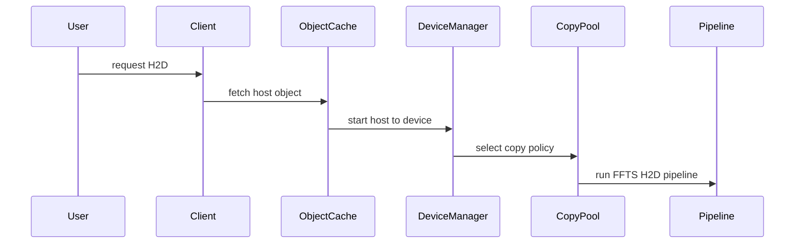
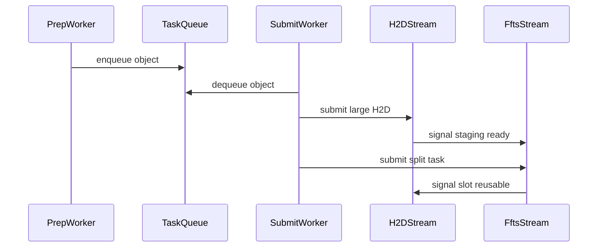

# Yuanrong 两段式 H2D 流水线分析

这份文档只分析 yuanrong 里本地 H2D 的 pipeline 写法，重点看它如何把一个 host object 拷到 device 中转区，再用 FFTS 拆成多个 device blob。这里的目标不是复述全部对象缓存流程，而是提炼出我们当前 Ascend copy 两段式 H2D 可以参考的流水线结构。

## 先说结论

yuanrong 的 FFTS H2D 不是让 FFTS 直接从 host 读数据。它的主路径是两段式：

```text
host object 连续数据 -> device 中转 buffer -> 多个 device blob
```

第一段是普通 Ascend H2D 异步拷贝，把一个 object 的连续 host 数据一次性拷到 device 中转 buffer。

第二段是 FFTS SDMA，把中转 buffer 按 blob 边界拆到最终 device blob 地址。

流水线的关键是双缓冲：

- device 中转 buffer 有 2 个 slot。
- `secondaryStream` 负责第一段大 H2D。
- `primaryStream` 负责第二段 FFTS split。
- `toPinDone` 表示某个 slot 的 H2D 已经完成，可以被 FFTS 使用。
- `toDestDone` 表示某个 slot 的 FFTS 已经完成，可以重新被 H2D 使用。

对应文件：

`@yuanrong-datasystem/src/datasystem/common/device/ascend/acl_resource_manager.h`

`@yuanrong-datasystem/src/datasystem/common/device/ascend/acl_resource_manager.cpp`

## 一个 object 是什么

在 H2D 语义里，用户传入的是一组 key 和一组 `DeviceBlobList`。每个 key 对应一个 host object；每个 `DeviceBlobList` 描述这个 object 最终要写到哪些 device blob。

`DeviceBlobList` 里包含：

- `blobs`：一组 device 地址和大小。
- `deviceIdx`：这些 blob 所在的 device。
- `srcOffset`：源数据偏移。

对应文件：

`@yuanrong-datasystem/include/datasystem/hetero/device_common.h`

`MGetH2D` 从 worker 拿到 host object 后，本地看到的 host buffer 不是多个散地址，而是一块带描述头的连续 buffer。描述头里保存 blob 数量和每个 blob 的 offset。真正的数据从第一个 offset 开始，后面按 blob 顺序连续摆放。

对应文件：

`@yuanrong-datasystem/src/datasystem/common/object_cache/buffer_composer.cpp`

## H2D 入口路径

入口从用户接口到 Ascend resource manager 的路径是：



图里省略真实函数签名，真实代码位置如下：

`@yuanrong-datasystem/src/datasystem/client/object_cache/object_client_impl.cpp`

`@yuanrong-datasystem/src/datasystem/client/object_cache/device/client_device_object_manager.cpp`

`@yuanrong-datasystem/src/datasystem/common/device/ascend/acl_resource_manager.cpp`

具体链路可以这样读：

1. 客户端接口检查 key 和 device blob 参数。
2. 客户端从 worker 拉取 host object。
3. 客户端保留 host buffer 的生命周期，直到 H2D 完成。
4. 本地 H2D 路径调用设备对象管理器。
5. 设备对象管理器根据方向进入 resource manager。
6. resource manager 构造批量拷贝 helper。
7. Ascend 拷贝池根据策略选择 FFTS pipeline 或 direct batch。
8. FFTS pipeline 创建 `FftsPipelineH2DCopier` 并执行。

## C++ 代码路径怎么读

读这条路径时，不要一上来就钻进每个工具类。建议按“入口函数、对象管理、输入数据结构、策略选择、pipeline 字段、执行入口、核心提交、底层 dispatcher”这条顺序读。

第一层先读用户入口。你只要确认 H2D 请求最终会进 `MGetH2D`，并且 host object 拿回来后会调用 `HostDataCopy2Device`。这一层先不要关心 FFTS，只看数据从“对象缓存”进入“设备拷贝”。

对应文件：

`@yuanrong-datasystem/src/datasystem/client/object_cache/object_client_impl.cpp`

第二层读设备对象管理器。这里的关键是 `MemCopyBetweenDevAndHost`，它根据方向选择 H2D 或 D2H。对 H2D 来说，它会把 `devBlobList` 和 host `bufferList` 继续交给 resource manager。

对应文件：

`@yuanrong-datasystem/src/datasystem/client/object_cache/device/client_device_object_manager.cpp`

第三层读输入数据结构。先搞清楚 `DeviceBlobList` 和 `BufferMetaInfo`，再读 helper。`DeviceBlobList` 是用户给的 device 侧目标，`BufferMetaInfo` 是 helper 整理出来的 object 调度信息。

对应文件：

`@yuanrong-datasystem/include/datasystem/hetero/device_common.h`

`@yuanrong-datasystem/src/datasystem/common/device/device_resource_manager.h`

`@yuanrong-datasystem/src/datasystem/common/device/device_batch_copy_helper.h`

第四层读 H2D 策略选择。`MemcpyBatchH2D` 会先准备 helper，再进入 `AclMemCopyPool`。这里先看 `ShouldFallbackToDirectForH2D`，确认什么情况下不能走 FFTS pipeline。然后看创建 `FftsPipelineH2DCopier` 的地方。

对应文件：

`@yuanrong-datasystem/src/datasystem/common/device/ascend/acl_resource_manager.cpp`

第五层读真正的 pipeline 类。先看头文件里的字段，不要急着看函数体：

- `transferHostBuffers_` 是 host 中转区。
- `transferDeviceBuffers_` 是 device 双缓冲中转区。
- `primaryStream` 是 FFTS split stream。
- `secondaryStream` 是大 H2D stream。
- `toPinDone` 表示 H2D 写入中转区完成。
- `toDestDone` 表示 FFTS 写入最终目标完成。
- `submitCount_` 决定当前 object 用哪个 slot。
- `bufferMetas_` 描述每个 object 包含多少 blob。

对应文件：

`@yuanrong-datasystem/src/datasystem/common/device/ascend/acl_resource_manager.h`

第六层读 `ExecuteMemcpy`。它是入口函数，但它不是最底层提交函数。这里重点看两条并发线：一条通过 `h2hCopyPool` 准备 host 中转 buffer，另一条通过 `fftsCopyPool` 初始化 stream 和 notify，并等待任务到来后调用 `SubmitToStream`。

对应文件：

`@yuanrong-datasystem/src/datasystem/common/device/ascend/acl_resource_manager.cpp`

第七层读 `SubmitToStream`。这是 H2D pipeline 的核心。你可以把它当作一段固定模板读：

1. 选 slot。
2. H2D stream 等 slot 空闲。
3. H2D stream 做一次大 H2D。
4. H2D stream 通知 FFTS stream。
5. FFTS stream 等 H2D 完成。
6. FFTS stream 构造多条 D2D split context。
7. FFTS stream launch。
8. FFTS stream 通知 slot 可复用。

对应文件：

`@yuanrong-datasystem/src/datasystem/common/device/ascend/acl_resource_manager.cpp`

最后再读 dispatcher。dispatcher 不是业务调度层，而是把 `MemcpyAsync`、dependency 和 launch 转成 FFTS context。读它时只需要确认三件事：每次 `MemcpyAsync` 添加一个 SDMA context；`AddTaskDependency` 把同一 lane 串起来；`LaunchFftsTask` 才真正提交给 runtime。

对应文件：

`@yuanrong-datasystem/src/datasystem/common/device/ascend/ffts_dispatcher.h`

`@yuanrong-datasystem/src/datasystem/common/device/ascend/ffts_dispatcher.cpp`

## helper 怎么把 object 和 blob 整理出来

`DeviceBatchCopyHelper` 是 H2D pipeline 的输入整理层。它把 host object 和 device blob 整理成几组平铺数组。

对 H2D 来说，它输出的关键数据是：

- `srcBuffers`：每个 object 的连续 host 数据区域。
- `dstBuffers`：所有 device blob 的平铺列表。
- `bufferMetas`：每个 object 对应多少个 blob、这些 blob 在平铺列表中的起点、object 总大小。
- `srcList` 和 `dstList`：direct batch fallback 使用的逐 blob 地址数组。
- `dataSizeList`：每个 blob 的大小。

对应文件：

`@yuanrong-datasystem/src/datasystem/common/device/device_batch_copy_helper.h`

`bufferMetas` 是后面 pipeline 能按 object 提交的关键。没有它，代码只看到一堆 blob 地址，看不出哪些 blob 属于同一个 object。

## 什么时候走 FFTS pipeline

Ascend H2D 的策略来自环境配置，默认策略在 resource manager 里是 FFTS。真正执行前会检查是否需要 fallback 到 direct。

H2D fallback 的核心条件是内存池放不下：

- 每个 object 都需要能放进一个 device 中转 slot。
- 因为 pipeline 深度是 2，所以单个 object 大小乘以 2 不能超过 device 中转内存池大小。
- 如果不是 huge FFTS 的跳过 host 中转模式，所有 object 的 host 中转总大小不能超过 host 中转内存池大小。

对应文件：

`@yuanrong-datasystem/src/datasystem/common/device/device_resource_manager.h`

`@yuanrong-datasystem/src/datasystem/common/device/ascend/acl_resource_manager.cpp`

如果检查通过，H2D 使用 `FftsPipelineH2DCopier`。如果检查失败，回退到普通 batch copy。

## pipeline 资源结构

H2D pipeline 运行前会准备几类资源：

- host 中转 buffer：每个 object 一块，除非 huge FFTS 模式下跳过 host 到 host 拷贝。
- device 中转 buffer：固定 2 块，每块大小按最大 object 大小分配。
- `primaryStream`：运行 FFTS split。
- `secondaryStream`：运行大 H2D。
- `toPinDone`：H2D 阶段完成通知。
- `toDestDone`：FFTS 阶段完成通知。
- `fftsDispatcher`：把中转区到 device blobs 的 D2D copy 转成 FFTS context 并 launch。

对应文件：

`@yuanrong-datasystem/src/datasystem/common/device/ascend/acl_resource_manager.h`

`@yuanrong-datasystem/src/datasystem/common/device/ascend/acl_resource_manager.cpp`

资源初始化时会先创建 dispatcher，再创建两个 stream，最后为两个 pipeline slot 分别创建两组 notify。`NotifyStart` 会先把两个 `toDestDone` 记录到 `secondaryStream`，相当于告诉 H2D 阶段：两个 slot 初始都是空闲的。

## ExecuteMemcpy 的两条线程线

`ExecuteMemcpy` 内部有两条并发线：

一条是 host 到 host 的准备线。它使用 `h2hCopyPool`，把原始 host object 数据拷到 host 中转 buffer。这个动作完成后，调用通知函数把 object 加进待提交队列。

另一条是 FFTS 提交线。它使用 `fftsCopyPool`，初始化 ACL 资源，启动 slot 初始通知，然后在条件变量上等待待提交任务。拿到任务后，它调用 `SubmitToStream` 逐个 object 提交 H2D 和 FFTS。

对应文件：

`@yuanrong-datasystem/src/datasystem/common/device/ascend/acl_resource_manager.cpp`



这里的“准备线程”和“提交线程”不是源码名字，只是阅读时的角色划分。

## AddTask 做了什么

`AddTask` 的输入是一个 object index 和所有目标 device blobs。

它做三件事：

1. 找到这个 object 在原始 `bufferMetas` 里的 blob 数量、blob 起点和 object 大小。
2. 把这个 object 的 host 中转 buffer 加入 `tasks.srcBuffers`。
3. 把这个 object 对应的 device blob 地址依次加入 `tasks.destBuffers`。
4. 生成新的 `tasks.bufferMetas`，这里的 `firstBlobOffset` 指向当前批次内部的 blob 起点。

对应文件：

`@yuanrong-datasystem/src/datasystem/common/device/ascend/acl_resource_manager.cpp`

这里有一个容易忽略的点：`ExecuteMemcpy` 可以一次拿到多个已经准备好的 object，所以 `tasks.destBuffers` 是一个批次内的平铺 blob 列表。新的 `bufferMetas` 是为了描述这个批次内每个 object 的 blob 范围。

## SubmitToStream 是流水线核心

`SubmitToStream` 才是真正把 H2D 和 FFTS 串成 pipeline 的地方。每个 object 都按 `submitCount % 2` 选择 slot。

单个 object 的执行步骤是：

1. 选择一个 device 中转 slot。
2. `secondaryStream` 等待这个 slot 的 `toDestDone`。
3. `secondaryStream` 提交一次大 H2D，把 object 连续数据拷到 device 中转 slot。
4. `secondaryStream` 记录 `toPinDone`。
5. `primaryStream` 等待 `toPinDone`。
6. `primaryStream` 为这个 object 的每个 device blob 添加一条 FFTS memcpy context。
7. 同一 ready lane 上的 context 加 dependency。
8. `primaryStream` launch FFTS task。
9. dispatcher context 复用前重置。
10. `primaryStream` 记录 `toDestDone`，释放这个 slot 给后续 H2D。

对应文件：

`@yuanrong-datasystem/src/datasystem/common/device/ascend/acl_resource_manager.cpp`

`@yuanrong-datasystem/src/datasystem/common/device/ascend/ffts_dispatcher.h`

`@yuanrong-datasystem/src/datasystem/common/device/ascend/ffts_dispatcher.cpp`

## 双缓冲如何重叠

假设有三个 object，pipeline 深度为 2：

```text
object 0 使用 slot 0
object 1 使用 slot 1
object 2 再回到 slot 0
```

slot 0 上 object 2 的 H2D 必须等待 object 0 的 FFTS split 记录 `toDestDone`。slot 1 同理。

这样能形成重叠：

- `secondaryStream` 可以在 slot 1 上做 object 1 的 H2D。
- `primaryStream` 可以同时在 slot 0 上做 object 0 的 FFTS split。
- 两个 slot 分别用 notify 保证不会覆盖正在被 FFTS 读取的中转区。

所以它不是“把所有 object 先 H2D 完再 FFTS”，也不是“一个 object 的所有 blob 各自 H2D”。它是按 object 粒度做一段大 H2D，再按 blob 粒度做 FFTS split，并通过两个 slot 让相邻 object 的两段工作重叠。

## FFTS 部分怎么组织

对一个 object，FFTS 看到的是从 device 中转 buffer 到多个 device blob 的 D2D copy。

每个 blob 对应一条 FFTS memcpy context：

```text
src = device 中转 buffer 的当前 offset
dst = 第 n 个 device blob
size = 第 n 个 blob 大小
```

context 按最多 8 条 ready lane 组织。第 0 个、第 1 个直到第 7 个 context 可以作为初始 ready；第 8 个会依赖第 0 个，第 9 个会依赖第 1 个，以此类推。

这和我们当前 Ascend copy 的 `BuildCopies` 思路是一致的：用 ready lane 控制 FFTS task 内部初始并发宽度，用 dependency 把后续 context 串到相同 lane 后面。

对应文件：

`@yuanrong-datasystem/src/datasystem/common/device/ascend/acl_resource_manager.cpp`

`@yuanrong-datasystem/src/datasystem/common/device/ascend/ffts_dispatcher.cpp`

## 和当前 copy benchmark 的对应关系

我们当前的两段式 H2D instance 是：

```text
host 连续 buffer -> device transfer buffer -> fragmented device buffers
```

yuanrong 的两段式 H2D 是：

```text
host object 连续数据 -> device 中转 slot -> device blobs
```

两边核心模型一致：

- 第一段都是一次大 H2D。
- 第二段都是 FFTS D2D split。
- split 的目标都是多个离散 device 地址。
- FFTS 内部都用多条 ready lane 加依赖链。

差异也很关键：

- 当前 copy benchmark 是单 stream 顺序提交大 H2D 再提交 FFTS。
- yuanrong 使用两个 stream，把大 H2D 和 FFTS split 分开。
- 当前 copy benchmark 的 transfer buffer 只有一组。
- yuanrong 的 device 中转 buffer 是双缓冲。
- 当前 copy benchmark 一次 case 通常处理一个 buffer 对。
- yuanrong 按 object 批次处理，object 内再拆成多个 blob。
- yuanrong 还有 host 中转层和 H2H 准备线程，用来把 host object 数据整理到适合 H2D 的连续 pin buffer。

对应文件：

`@dev-sandbox/module/copy/ascend/copy_instance_ffts_pipeline_ascend.h`

`@yuanrong-datasystem/src/datasystem/common/device/ascend/acl_resource_manager.cpp`

## 对我们后续改造的启发

如果后续要把当前 Ascend copy 的 H2D FFTS split 改得更像 yuanrong，重点不是改 FFTS context 构造，而是改流水线调度：

1. 把 device transfer buffer 扩成两个 slot。
2. 拆出 H2D stream 和 FFTS stream。
3. 每个 slot 配两类通知：H2D 完成通知和 FFTS 完成通知。
4. H2D stream 只在 slot 空闲后写入。
5. FFTS stream 只在 H2D 完成后读取该 slot。
6. FFTS 完成后释放 slot。
7. benchmark 统计时要明确测的是整条 pipeline 时间，还是单段 H2D 或单段 FFTS 时间。

这也是 yuanrong pipeline 最值得参考的地方：它并不是为了减少单个 object 内部的步骤，而是为了让不同 object 的 H2D 阶段和 FFTS 阶段互相重叠。

## 最容易混的点

`FFTS H2D` 这个名字容易误导。yuanrong 里真正的 Host-to-Device 仍然是 `aclrtMemcpyAsync`，FFTS 负责的是 device 中转区到 device blobs 的 D2D split。

一个 object 不是一个 blob。一个 object 可以包含多个 blob，host 侧是一块连续 object 数据，device 侧是多个 blob 地址。

双缓冲不是双线程本身。双缓冲指的是两个 device 中转 slot，两个 stream 通过 notify 管理 slot 生命周期。

`toPinDone` 不是 CPU 线程通知，它是 stream 间同步用的 runtime notify。

`toDestDone` 的意义是目标 blobs 已写完，同时也代表这个中转 slot 可以给下一轮 H2D 复用。

FFTS dispatcher 的 `MemcpyAsync` 不是普通 ACL H2D copy，它只是往 FFTS context 列表里追加一条 SDMA 描述；真正提交发生在 launch。
