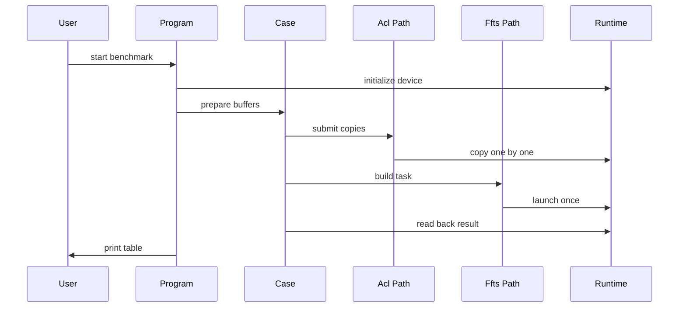
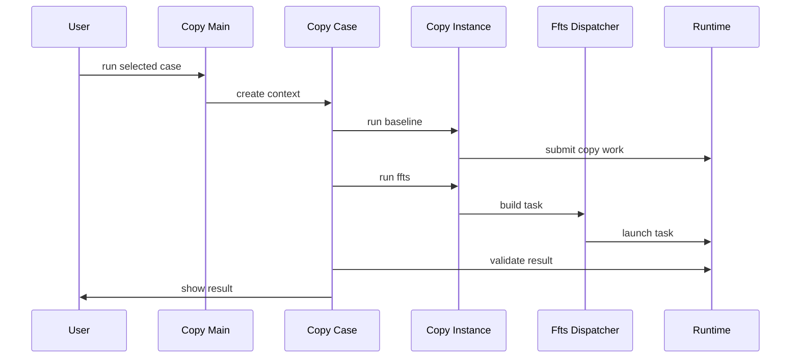

# FFTS D2D Benchmark 整合方案

## 背景

本文档分析 `ffts_vs_acl_d2d_benchmark.cpp` 的当前实现，并给出将其能力整合进 `module/copy/ascend` 的方案。

涉及文件：

`@examples/ffts_d2d_benchmark/ffts_vs_acl_d2d_benchmark.cpp`

`@examples/ffts_d2d_benchmark/ffts_plus_minimal_runtime.h`

`@module/copy/ascend/copy_case_ascend.cc`

`@module/copy/ascend/copy_instance_ascend.h`

`@module/copy/ascend/copy_buffer_ascend.h`

`@module/copy/CMakeLists.txt`

`@cmake/DetectRuntime.cmake`

## Benchmark 代码现状

`ffts_vs_acl_d2d_benchmark.cpp` 是一个独立可执行程序，自己完成参数解析、AscendCL 初始化、buffer 分配、copy 提交、计时、结果打印和正确性校验。它对比两条 D2D 路径：

- ACL 路径：对每个片段调用一次 `aclrtMemcpyAsync`，可按 stream 数把 copy 分摊到多个 stream。
- FFTS 路径：把每个 D2D copy 构造成一个 FFTS SDMA context，再通过一次 `rtFftsPlusTaskLaunchWithFlag` 提交。

它覆盖两个数据形态：

- merge：多个离散源 buffer 汇聚到一个连续 transfer buffer。
- split：一个连续 transfer buffer 拆分到多个离散目标 buffer。

关键内部结构和函数：

- `Options`：保存 device id、test type、copy path、单个 IO 大小、buffer 数量、迭代次数和 stream 数。
- `CopySpec`：保存单个 D2D copy 的 `dst`、`src`、`size`。
- `DeviceBuffer`：Ascend device memory 的 RAII 封装。
- `MiniFftsD2DDispatcher`：维护 FFTS context 数组，负责添加 memcpy context、添加依赖链、launch task。
- `BuildFftsCopies`：把 `CopySpec` 列表映射成最多 8 条 ready lane 的 FFTS 依赖链。
- `MergeCase` 和 `SplitCase`：负责构造测试数据、生成 copy 列表、清零输出和 D2H 校验。
- `SubmitAclCopies`：逐个提交 `aclrtMemcpyAsync`。
- `MeasureCopyOnce` 和 `RunMeasuredPath`：分别统计 build、submit、stream 侧 copy 时间。

计时语义：

- build 时间只对 FFTS 有意义，表示 host 侧构造 SDMA context 和依赖链的耗时。
- submit 时间使用 host 侧时钟，表示提交 ACL memcpy 或 FFTS launch 的 API 调用耗时。
- copy 时间使用 Ascend event，表示 stream 上从 start event 到 stop event 的设备侧耗时。

## copy/ascend 现有结构

`module/copy` 已经有比较清晰的三层抽象：

- `CopyCase`：注册可通过 `copy -t <name>` 选择的 benchmark case。
- `CopyInstance`：封装一次 copy 方法，负责 prepare、warmup、迭代测量和 cleanup。
- `CopyBuffer`：封装 host、device、anonymous 等 buffer 类型，并通过索引得到每个片段地址。

Ascend 后端已有能力：

- `CopyRuntime` 在程序生命周期内调用 `aclInit` 和 `aclFinalize`。
- `DeviceCopyBuffer` 使用 `aclrtMalloc` 分配连续 device buffer，并按 `size * index` 给出片段地址。
- `D2DCECopyInstance` 已经实现普通 ACL D2D baseline。
- `AscendCopyInstanceBase` 已经实现 stream、event、submit 时间、copy 时间和多 buffer batch 的通用测量框架。

现有缺口：

- 尚未在 CMake 中显式接入 FFTS Plus 相关 include 路径。
- 没有链接 `libruntime.so`，只链接了 `libascendcl.so`。
- `CopyBuffer` 当前默认只有一段连续地址，无法精确表达 benchmark 中“多个离散 allocation”的 merge 和 split。
- `CopyCase::Context` 没有 stream count，无法复用 example 中 ACL multi-stream baseline。
- 现有 D2D case 没有正确性校验，benchmark 的 pattern 初始化和 D2H 校验需要补进来。

## 整合目标

推荐目标不是把 example 的 `main` 直接搬进 `module/copy/ascend`，而是把它拆成模块内可复用能力：

- FFTS SDMA context 构造和 launch 成为 Ascend copy instance 的一种实现。
- merge 和 split 成为 `copy` 可选择的 case。
- ACL CE 路径继续作为 baseline，结果格式复用 `CopyResult`。
- benchmark 参数尽量映射到现有 `copy` 参数：`size` 对应单个 IO 大小，`num` 对应 buffer 数量，`iter` 对应测量迭代次数，`nDevice` 控制跑多少个 device。
- `-d` 在 copy 程序里继续表示 device count，不改成 example 的 device id，避免破坏现有语义。
- 如需 multi-stream baseline，新增 `-m <stream_count>`，默认 1，仅新 case 使用。

## 推荐文件拆分

新增文件：

`@module/copy/ascend/ffts_d2d_dispatcher_ascend.h`

用途：从 `MiniFftsD2DDispatcher` 抽出 FFTS SDMA context 构造、依赖链构造和 task launch。

`@module/copy/ascend/copy_instance_ffts_ascend.h`

用途：新增 `D2DFFTSCopyInstance`，接入 `CopyInstance` 测量框架。

`@module/copy/ascend/copy_case_ffts_d2d_ascend.cc`

用途：注册 merge/split 对比 case，负责构造 patterned buffer、运行 CE 和 FFTS、执行校验。

可选新增文件：

`@module/copy/ascend/copy_buffer_fragmented_ascend.h`

用途：如果要求完全复刻 example 的“离散 allocation”，新增 fragmented device buffer。它需要配合 `CopyBuffer` 增加虚函数式地址访问。

## 核心设计

### 1. FFTS dispatcher 模块化

把 `MiniFftsD2DDispatcher` 改造成不依赖 example 私有类型的模块内类，例如 `FftsD2DDispatcher`。

保留逻辑：

- 单个 copy 转换为 `rtFftsPlusSdmaCtx_t`。
- `sourceAddressBaseL`、`sourceAddressBaseH`、`destinationAddressBaseL`、`destinationAddressBaseH` 写入 64 位地址拆分结果。
- `nonTailDataLength` 和 `tailDataLength` 写入 copy size。
- context 数组使用 `rtFftsPlusComCtx_t` 存放，并通过 reinterpret 写入 SDMA context。
- ready lane 数为 `min(copy_count, 8)`。
- 超过 ready lane 后，同一 lane 内添加 predecessor 和 successor 依赖。
- `Launch` 生成 `rtFftsPlusSqe_t` 和 `rtFftsPlusTaskInfo_t`，调用 `rtFftsPlusTaskLaunchWithFlag`。

建议调整：

- 将错误处理改为 `ASCEND_ASSERT` 或模块内 `ASSERT` 风格，保持 copy 模块一致。
- 将 `CopySpec` 命名为模块内通用结构，例如 `AscendD2DCopySpec`。
- 对 copy size 保留 `uint32_t` 上限检查，因为当前 SDMA context 长度字段是 32 位。
- 保留 `sizeof` static assert，防止 CANN 头文件结构与当前构造逻辑不匹配。

### 2. FFTS CopyInstance 接入

新增 `D2DFFTSCopyInstance`，建议继承 `AscendCopyInstanceBase`，复用现有 prepare、event、warmup、迭代统计、cleanup 流程。

实现要点：

- `CopyInternal` 内把 `AscendStreamContext` 中的 `src`、`dst`、`size` 转成 copy spec 列表。
- 每次 measured iteration 都重新 build dispatcher，以保留 benchmark 的 build 时间语义。
- 当前 `CopyInstance` 的结果只返回 submit 和 copy 时间，不返回 build 时间。建议先把 build 时间计入 submit 时间，方法名标记为 `FFTS`。如果需要完整复刻 example 输出，再扩展 `CopyResult::Result` 增加 build 字段。
- `SynchronizeInternal` 仍使用 `aclrtSynchronizeStream`，和现有 Ascend CE 路径保持一致。

如果要保留 build、submit、copy 三列，推荐小改 `CopyInstance`：

- `DoCopyOnce` 的返回值从两个字段扩展为三个字段。
- CE 类 build 时间固定为 0。
- `CopyResult` 增加 Build 统计列。

如果想控制改动范围，第一阶段可以不改公共统计结构，只输出 `Submit(us)` 和 `Copy(us)`，把 build 作为 FFTS submit 的一部分。

### 3. merge 和 split case 注册

建议注册两个对比 case：

- `ascend_d2d_merge_ffts_vs_acl`
- `ascend_d2d_split_ffts_vs_acl`

每个 case 在每个 device 上构造一组 buffer，分别跑 ACL CE 和 FFTS，并把两个结果 push 到同一个 `CopyResult` 中。

merge 的数据组织：

- 源端是 N 个片段。
- 目标端是一个连续 transfer buffer 的 N 个 offset。
- CE 和 FFTS 使用相同 `src`、`dst` 列表。

split 的数据组织：

- 源端是一个连续 transfer buffer 的 N 个 offset。
- 目标端是 N 个片段。
- CE 和 FFTS 使用相同 `src`、`dst` 列表。

正确性校验：

- 初始化阶段用 host pattern 写入源端 device buffer。
- 每条路径运行前清零目标端。
- 运行后 D2H 回读目标端并比较 pattern。
- 校验不计入测量时间。

### 4. buffer 表达方式

有两种可选实现路径。

轻量路径：

- 继续使用当前 `DeviceCopyBuffer` 的连续大 allocation。
- N 个片段通过 offset 表达。
- 优点是改动少，能快速比较 ACL 多次 memcpy 和 FFTS 单次 launch 的提交差异。
- 缺点是不能完全复刻 example 中每个 fragment 独立 allocation 的内存形态。

精确路径：

- 给 `CopyBuffer` 增加虚函数式地址访问，例如 `At(index)`。
- 默认实现仍返回 `addr + index * size`。
- `operator[]` 调用 `At(index)`，保持调用侧不变。
- 新增 `FragmentedDeviceCopyBuffer`，内部持有 N 个 `aclrtMalloc` 得到的独立 device pointer。
- merge 使用 fragmented src 和 contiguous dst。
- split 使用 contiguous src 和 fragmented dst。

推荐采用精确路径，因为原 benchmark 的目标就是观察多 buffer merge/split，对离散 allocation 的表达更接近真实场景。

### 5. 参数和输出

建议保留现有 copy CLI：

- `-t`：选择 case。
- `-s`：单个 IO 大小。
- `-n`：buffer 数量。
- `-i`：迭代次数。
- `-d`：device count。

新增：

- `-m`：stream count，默认 1。

推荐运行方式：

```text
copy -t ascend_d2d_merge_ffts_vs_acl -s 64K -n 1024 -i 128 -d 1 -m 4
copy -t ascend_d2d_split_ffts_vs_acl -s 64K -n 1024 -i 128 -d 1 -m 4
```

输出方式：

- 第一阶段复用 `CopyResult`，method 分别为 `CE` 和 `FFTS`。
- 第二阶段如需和 example 完全一致，再把 `Build(us)`、`Build/IO(us)` 加入 `CopyResult`。

## 构建方案

`DetectRuntime.cmake` 当前只查找 `acl/acl.h` 和 `libascendcl.so`。FFTS 路径还需要：

- 查找 `libruntime.so`。
- 查找官方 FFTS header 的可能路径，并把该 include 目录传给 Ascend copy 目标。

建议在 Ascend 检测成功时增加：

- `ASCEND_RUNTIME_LIBRARY`：指向 `libruntime.so`，找不到时关闭 FFTS case 或只编译 CE。
- `ASCEND_EXTRA_INCLUDE_DIRS`：加入 CANN 的 `pkg_inc`、`pkg_inc/runtime` 等候选目录。
- `HAVE_ASCEND_FFTS_RUNTIME`：用于控制是否注册 FFTS case。

`module/copy/CMakeLists.txt` 的 Ascend 分支建议：

- 继续 glob `ascend/*.cc` 和 `ascend/*.h`。
- 链接 `Ascend::Runtime`。
- 如果找到 `libruntime.so`，额外链接 runtime library。
- 如果找不到 `libruntime.so`，不要编译 FFTS instance 和 FFTS case，避免链接失败。

## 集成后时序

现有 example 的核心流程：



整合进 copy 后的推荐流程：



对应代码角色：

- `Copy Main` 对应 `copy_main.cc`。
- `Copy Case` 对应新增的 FFTS D2D case 文件。
- `Copy Instance` 对应现有 `AscendCopyInstanceBase` 和新增 `D2DFFTSCopyInstance`。
- `Ffts Dispatcher` 对应从 `MiniFftsD2DDispatcher` 抽出的 dispatcher。
- `Runtime` 对应 AscendCL 和 FFTS Plus runtime。

## 分阶段实施

第一阶段：最小可用整合

- 新增 FFTS dispatcher。
- 新增 `D2DFFTSCopyInstance`。
- 注册一个普通 `device_to_device_ffts` case，用连续 `DeviceCopyBuffer` 验证 FFTS launch 能接入 copy 框架。
- CMake 增加 runtime library 检测和链接。

第二阶段：复刻 merge/split benchmark

- 增加 pattern 初始化和 D2H 校验工具。
- 注册 `ascend_d2d_merge_ffts_vs_acl` 和 `ascend_d2d_split_ffts_vs_acl`。
- 如果采用精确路径，先扩展 `CopyBuffer` 的地址访问，再新增 fragmented device buffer。
- CE 和 FFTS 使用同一份 copy spec，确保对比公平。

第三阶段：输出和 sweep 对齐

- 增加 `-m` stream count。
- 如有需要，扩展 `CopyResult` 支持 build 时间。
- 把 example 的 sweep 逻辑迁移为脚本或 README 示例，统一从 `copy` 二进制运行。

## 验证计划

构建验证：

- 无 Ascend 环境时，Simulation 后端不应受新增文件影响。
- 有 Ascend 环境但无 `libruntime.so` 时，CE case 仍可构建，FFTS case 应明确跳过。
- 有 Ascend 环境且有 `libruntime.so` 时，`copy` 应成功链接。

运行验证：

- 小规模 smoke：`size=2K`、`num=4`、`iter=3`、`device count=1`。
- 中规模对齐：`size=64K`、`num=1024`、`iter=128`。
- merge 和 split 都必须通过 D2H 校验。
- CE 与 FFTS 的 copy 总字节数、buffer 数量、stream 计时范围必须一致。

结果校验：

- `FFTS` method 的 submit 时间应显著体现单次 launch 的特征。
- `CE` method 的 submit 时间应随 buffer count 线性上升。
- copy 时间和带宽需要与原 example 同量级，不要求完全相同，因为整合后可能使用统一统计框架。

## 风险和注意事项

- FFTS Plus 结构和 `rtFftsPlusTaskLaunchWithFlag` 属于低层 runtime 能力，CANN 版本差异可能导致 header 或 ABI 不一致。
- FFTS 官方 header 必须配合结构大小检查，任何不匹配都应在编译期或启动早期暴露。
- `kSdmaFp32AtomicMoveSqe` 这类 magic value 应集中放在 dispatcher 内，并用注释说明来源和适用范围。
- 单个 copy size 受 32 位长度字段限制，超大 buffer 需要显式拒绝。
- multi-stream ACL baseline 的 stop event 必须等待所有 stream 的 end event 后再记录，否则 copy 时间会偏小。
- 如果扩展 `CopyBuffer` 为虚函数访问，需要确认 CUDA、GDR、Simulation 后端都仍按原语义工作。

## 推荐结论

推荐按“先接入 FFTS instance，再补齐 merge/split case，最后扩展输出列”的顺序推进。这样可以把最大风险隔离在 Ascend 后端，不影响 CUDA、GDR 和 Simulation 的现有 case；同时也能逐步把 example 中真正有价值的能力沉淀到 `copy` 模块，而不是保留一个重复的独立 benchmark 程序。
