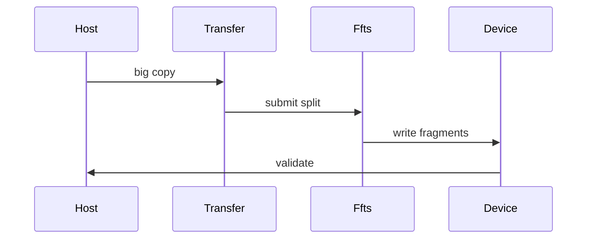
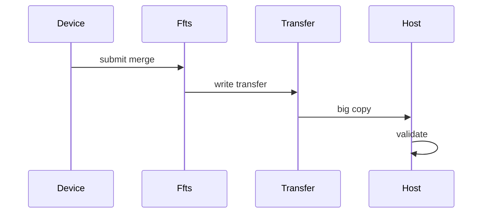

# FFTS 大 IO 聚合 Pipeline 方案

## 核心目标

使用 FFTS 的目的不是单纯把 H2D/D2H 和 D2D 串起来，而是把批量小 IO 变成少量大 IO，从而提升整体带宽。

目标链路有两条，方向相反：

- `H2D big copy + FFTS split`：Host 侧先做一次大 H2D，把连续大块数据拷到 device transfer buffer；再用 FFTS 在 device 侧 split 到多个离散 device buffer。
- `FFTS merge + D2H big copy`：多个离散 device buffer 先用 FFTS merge 到连续 device transfer buffer；再做一次大 D2H，把连续大块数据拷回 Host。

关键约束：

- H2D 阶段必须是一次大 IO，不是 N 次小 H2D。
- D2H 阶段必须是一次大 IO，不是 N 次小 D2H。
- FFTS 只负责 device 内部的 split/merge。
- 不新增 CLI 参数。
- 不修改 `CopyCase::Context`。
- 不新增 `vs acl` case。

## 性能假设

批量小 IO 的问题是每个小拷贝都有提交开销、调度开销和带宽利用不足。优化思路是：

1. Host 与 Device 之间只传一次连续大块。
2. Device 内部再用 FFTS 一次 launch 描述 N 个 SDMA copy。
3. 用大 H2D/D2H 提升总线传输效率，用 FFTS 降低 device 内 scatter/gather 的提交成本。

设：

- `fragment_size = ctx.size`
- `fragment_count = ctx.num`
- `total_bytes = fragment_size * fragment_count`

H2D/D2H 阶段传输大小应为 `total_bytes`。

## 实现约束

pipeline 实现必须遵守这个提交形态：

`@module/copy/ascend/copy_instance_ffts_pipeline_ascend.h`

- `H2DFFTSSplitCopyInstance` 在 FFTS split 前只调用一次 `aclrtMemcpyAsync`，从 Host 连续首地址拷贝 `total_bytes` 到 device transfer buffer 连续首地址。
- `FFTSMergeD2HCopyInstance` 在 FFTS merge 后只调用一次 `aclrtMemcpyAsync`，从 device transfer buffer 连续首地址拷贝 `total_bytes` 到 Host 连续首地址。
- 禁止按 fragment 循环提交 H2D 或 D2H，因为那仍然是 N 次小 IO，不能验证“大 IO 聚合”的目标。

## 数据组织

### Host Packed Buffer

Host buffer 必须按连续大块组织：

```text
host[0] host[1] ... host[N-1]
```

每个 fragment 仍然有独立 pattern，但内存上连续排列。

可以继续使用：

`@module/copy/ascend/copy_buffer_ascend.h`

其中 `HostCopyBuffer` 本身就是 `size * number` 的连续 host allocation。大 IO 使用 `buffer[0]` 作为首地址，长度使用 `size * number`。

### Device Transfer Buffer

Device transfer buffer 也必须是连续大块：

```text
transfer[0] transfer[1] ... transfer[N-1]
```

继续使用 `DeviceCopyBuffer`，大 IO 使用 `buffer[0]` 作为首地址，长度使用 `size * number`。

### Device Fragmented Buffer

离散 device buffer 表达批量小 IO 的真实目标：

```text
fragment 0
fragment 1
...
fragment N-1
```

继续使用 `FragmentedDeviceCopyBuffer`。

## 链路一：H2D Big Copy + FFTS Split

数据方向：

```text
Host packed buffer -> Device transfer buffer -> Device fragmented buffers
```

执行顺序：

1. Host packed buffer 用 N 个 pattern 初始化，每个 fragment 写入连续 Host 大块中的对应 offset。
2. 记录 start event。
3. 提交一次 H2D big copy：

```text
Host packed base -> Device transfer base, bytes = total_bytes
```

4. 构造 FFTS split copy specs：

```text
transfer fragment i -> device fragment i
```

5. 在同一个 stream 上提交一次 FFTS launch。
6. 记录 end event，并同步 stream。
7. 校验阶段从 fragmented device buffers 回读，每个 fragment 与 pattern 比较。

时序：



## 链路二：FFTS Merge + D2H Big Copy

数据方向：

```text
Device fragmented buffers -> Device transfer buffer -> Host packed buffer
```

执行顺序：

1. Device fragmented buffers 用 N 个 pattern 初始化，每个 device fragment 一个 pattern。
2. 记录 start event。
3. 构造 FFTS merge copy specs：

```text
device fragment i -> transfer fragment i
```

4. 在同一个 stream 上提交一次 FFTS launch。
5. 提交一次 D2H big copy：

```text
Device transfer base -> Host packed base, bytes = total_bytes
```

6. 记录 end event，并同步 stream。
7. 校验阶段直接检查 Host packed buffer 中每个 fragment offset 的 pattern。

时序：



## CopyInstance 设计

建议保留当前文件：

`@module/copy/ascend/copy_instance_ffts_pipeline_ascend.h`

但修正其中 H2D/D2H 提交流程。

### H2DFFTSSplitCopyInstance

Prepare 阶段：

- source 是 `HostCopyBuffer`。
- destination 是 `FragmentedDeviceCopyBuffer`。
- 内部创建一个连续 `DeviceCopyBuffer` 作为 transfer buffer。
- 生成 N 个 FFTS split specs。

DoCopyOnce 阶段：

1. 一次 `aclrtMemcpyAsync` 提交 H2D big copy。
2. 一次 `FftsD2DDispatcher` 提交 FFTS split。
3. stream event 覆盖完整 pipeline。

禁止：

- 禁止在 H2D 阶段循环 N 次 `aclrtMemcpyAsync`。

### FFTSMergeD2HCopyInstance

Prepare 阶段：

- source 是 `FragmentedDeviceCopyBuffer`。
- destination 是 `HostCopyBuffer`。
- 内部创建一个连续 `DeviceCopyBuffer` 作为 transfer buffer。
- 生成 N 个 FFTS merge specs。

DoCopyOnce 阶段：

1. 一次 `FftsD2DDispatcher` 提交 FFTS merge。
2. 一次 `aclrtMemcpyAsync` 提交 D2H big copy。
3. stream event 覆盖完整 pipeline。

禁止：

- 禁止在 D2H 阶段循环 N 次 `aclrtMemcpyAsync`。

## Case 设计

保留新增 case：

`@module/copy/ascend/copy_case_ffts_d2d_ascend.cc`

- `ascend_h2d_ffts_split`
- `ascend_ffts_merge_d2h`

这两个 case 只测试 pipeline，不做 ACL 对比。

已有 baseline 仍单独运行：

- `host_to_device_ce`
- `device_to_device_ce`
- 其他已有 copy case

## 计时语义

输出仍复用 `CopyResult`。

`submit` 时间：

- `H2D+FFTS`：一次 H2D big copy 提交 + 一次 FFTS launch 提交。
- `FFTS+D2H`：一次 FFTS launch 提交 + 一次 D2H big copy 提交。

`copy` 时间：

- 用同一个 stream 上的 event 统计完整 pipeline。
- 包含大 H2D/D2H 和 FFTS device 内 split/merge。

带宽语义：

- `CopyResult` 的总字节数仍是 `fragment_size * fragment_count`。
- 对 pipeline 来说，这个总字节数代表用户侧批量小 IO 的总 payload。

## 正确性校验

H2D big copy + FFTS split：

- Host packed buffer 每个 offset 写入对应 pattern。
- pipeline 完成后，回读每个 fragmented device buffer。
- 比较对应 pattern。

FFTS merge + D2H big copy：

- fragmented device source 每个 fragment 写入对应 pattern。
- pipeline 完成后，检查 Host packed buffer 每个 offset。
- 比较对应 pattern。

校验不计入计时。

## 最小改动范围

需要改：

- `@module/copy/ascend/copy_instance_ffts_pipeline_ascend.h`
- 必要时调整 `@module/copy/ascend/copy_case_ffts_d2d_ascend.cc` 的初始化和校验 helper。

不需要改：

- `@module/copy/copy_main.cc`
- `@module/copy/copy_case.h`
- `@module/copy/CMakeLists.txt`
- `@cmake/DetectRuntime.cmake`

## 推荐运行方式

```text
copy -t ascend_h2d_ffts_split -s 64K -n 1024 -i 128 -d 1
copy -t ascend_ffts_merge_d2h -s 64K -n 1024 -i 128 -d 1
```

其中 `64K * 1024` 会形成一次 64 MB 的 H2D 或 D2H 大 IO，再由 FFTS 处理 1024 个 64 KB fragment 的 split/merge。

## 验证重点

实现完成后，需要重点检查：

- H2D split pipeline 中 H2D API 调用次数必须是 1。
- D2H merge pipeline 中 D2H API 调用次数必须是 1。
- FFTS specs 数量仍然是 `ctx.num`。
- `total_bytes = ctx.size * ctx.num` 不溢出。
- `HostCopyBuffer` 和 `DeviceCopyBuffer` 都使用 `buffer[0]` 作为大 IO 首地址。
- D2H/H2D 大 IO 与 FFTS launch 在同一个 stream 中保持顺序。
