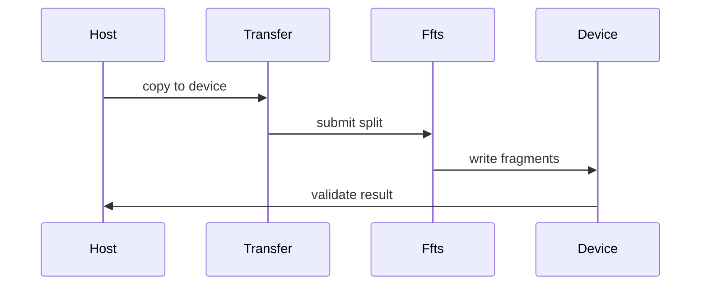
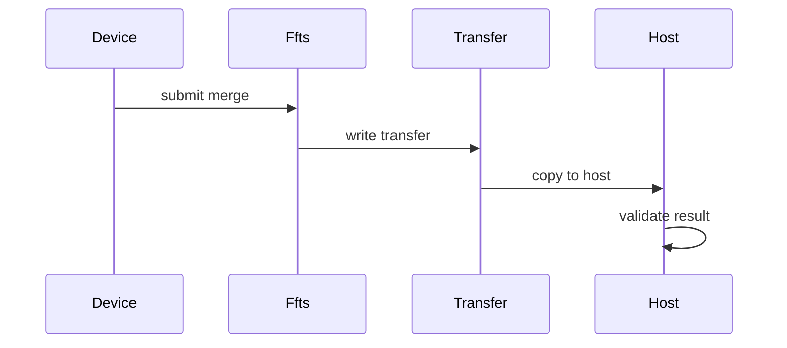

# FFTS H2D/D2H Pipeline 整合方案

## 目标

本方案把当前单独的 FFTS D2D split/merge 能力，整合成两条方向相反的端到端链路：

- `H2D + FFTS split`：Host 数据先拷贝到连续 device transfer buffer，再由 FFTS split 到多个离散 device buffer。
- `FFTS merge + D2H`：多个离散 device buffer 先由 FFTS merge 到连续 device transfer buffer，再拷贝回 Host。

这两条链路不做 `vs acl` 对比，不新增 CLI 参数，不修改 `CopyCase::Context`。已有 `device_to_device_ce`、`host_to_device_ce` 等 case 继续作为独立 baseline 使用。

## 当前基础

已有能力：

`@module/copy/ascend/copy_buffer_ascend.h`

- `HostCopyBuffer`：Host 侧连续 buffer。
- `DeviceCopyBuffer`：Device 侧连续 buffer，可按 index 访问连续片段。
- `FragmentedDeviceCopyBuffer`：Device 侧离散 buffer，每个 index 对应独立 device allocation。

`@module/copy/ascend/ffts_d2d_dispatcher_ascend.h`

- `FftsD2DDispatcher`：把 D2D copy spec 构造成 FFTS SDMA context，并一次 launch。

`@module/copy/ascend/copy_instance_ffts_ascend.h`

- `D2DFFTSCopyInstance`：当前只覆盖单段 D2D FFTS copy batch，能表达 split 或 merge，但不包含 H2D/D2H 阶段。

`@module/copy/ascend/copy_case_ffts_d2d_ascend.cc`

- `ascend_d2d_split_ffts`：连续 device buffer 到离散 device buffer。
- `ascend_d2d_merge_ffts`：离散 device buffer 到连续 device buffer。

## 新增 Case

建议新增两个 case：

- `ascend_h2d_ffts_split`
- `ascend_ffts_merge_d2h`

两者复用现有 `copy` 参数：

- `-s`：单个 fragment 大小。
- `-n`：fragment 数量。
- `-i`：迭代次数。
- `-d`：device count。

不新增 `-m` 或其他参数。

## 数据流设计

### H2D + FFTS Split

数据方向：

```text
Host fragments -> Device transfer buffer -> Device fragmented buffers
```

buffer 组织：

- source：`HostCopyBuffer`
- intermediate：`DeviceCopyBuffer`
- destination：`FragmentedDeviceCopyBuffer`

执行顺序：

1. Host source 使用 pattern 初始化。
2. 每次迭代先提交 H2D copy，把 Host fragments 拷贝到连续 device transfer buffer。
3. 在同一个 stream 后续提交 FFTS split，把 transfer buffer 的每个片段拷贝到对应离散 device buffer。
4. 记录同一个 stream 上的 start/end event，统计整条 `H2D + FFTS split` 链路耗时。
5. 迭代结束后 D2H 回读离散 device destination，校验每个 fragment pattern。

时序：



### FFTS Merge + D2H

数据方向：

```text
Device fragmented buffers -> Device transfer buffer -> Host fragments
```

buffer 组织：

- source：`FragmentedDeviceCopyBuffer`
- intermediate：`DeviceCopyBuffer`
- destination：`HostCopyBuffer`

执行顺序：

1. Device fragmented source 使用 pattern 初始化。
2. 每次迭代先提交 FFTS merge，把离散 device fragments 拷贝到连续 device transfer buffer。
3. 在同一个 stream 后续提交 D2H copy，把 transfer buffer 的每个片段拷贝到 Host destination。
4. 记录同一个 stream 上的 start/end event，统计整条 `FFTS merge + D2H` 链路耗时。
5. 迭代结束后直接校验 Host destination 的每个 fragment pattern。

时序：



## 实现方案

### 1. 新增 Pipeline CopyInstance

建议新增文件：

`@module/copy/ascend/copy_instance_ffts_pipeline_ascend.h`

新增两个类：

- `H2DFFTSSplitCopyInstance`
- `FFTSMergeD2HCopyInstance`

它们都继承 `CopyInstance`，但不复用 `AscendCopyInstanceBase`。原因是 pipeline 有 source、intermediate、destination 三类 buffer，而现有 `AscendCopyInstanceBase` 只表达 source/destination 两端。

两个类内部都维护：

- device id
- one stream
- start/end event
- intermediate `DeviceCopyBuffer`
- H2D 或 D2H copy spec 列表
- FFTS D2D copy spec 列表

`DoCopyOnce` 需要把两段操作放在同一个 stream 中提交，保持顺序依赖：

- `H2DFFTSSplitCopyInstance`：先 `aclrtMemcpyAsync` H2D，再 `FftsD2DDispatcher::Launch`。
- `FFTSMergeD2HCopyInstance`：先 `FftsD2DDispatcher::Launch`，再 `aclrtMemcpyAsync` D2H。

### 2. 复用 FFTS Dispatcher

不改 `FftsD2DDispatcher` 的核心逻辑，只复用它接收 D2D copy spec 的能力。

H2D + FFTS split 的 FFTS spec：

- `src`：连续 transfer buffer 的第 i 个片段。
- `dst`：离散 device destination 的第 i 个 fragment。
- `size`：`ctx.size`。

FFTS merge + D2H 的 FFTS spec：

- `src`：离散 device source 的第 i 个 fragment。
- `dst`：连续 transfer buffer 的第 i 个片段。
- `size`：`ctx.size`。

### 3. 新增 Case 注册

建议在现有 FFTS case 文件里继续注册，减少 CMake 改动：

`@module/copy/ascend/copy_case_ffts_d2d_ascend.cc`

新增：

- `AscendH2DFFTSSplitCase`
- `AscendFFTSMergeD2HCase`

如果后续觉得文件名 `d2d` 不再准确，再单独做低风险重命名；第一步不建议为了命名引入额外 churn。

### 4. 校验策略

H2D + FFTS split：

- Host source 用 `MakePattern(i, size)` 初始化。
- pipeline 运行完成后，D2H 回读 `FragmentedDeviceCopyBuffer` 的每个 fragment。
- 与同 index 的 Host pattern 比较。

FFTS merge + D2H：

- Device fragmented source 用 `MakePattern(i, size)` 初始化。
- pipeline 运行完成后，直接检查 Host destination 的每个 fragment。
- 与同 index 的 expected pattern 比较。

校验不计入 `CopyInstance::DoCopyBatch` 的计时，只在 case 层调用。

## 计时语义

输出仍复用 `CopyResult`，新增 method 名：

- `H2D+FFTS`
- `FFTS+D2H`

`submit` 时间：

- Host 侧提交整条 pipeline 的耗时。
- 包括多次 `aclrtMemcpyAsync` 提交和一次 FFTS launch 提交。

`copy` 时间：

- 使用 Ascend event 统计同一个 stream 上从 start 到 end 的设备侧耗时。
- 覆盖整条 pipeline，而不是只覆盖 FFTS 阶段。

如果后续需要分解各阶段耗时，可以再扩展 `CopyResult`，但本方案不改公共结果结构。

## 构建影响

当前 `module/copy/CMakeLists.txt` 已经只在检测到 FFTS header 和 `libruntime.so` 时编译 FFTS case。新增 pipeline case 应继续走同一个条件，不额外放宽依赖。

涉及文件：

`@module/copy/CMakeLists.txt`

如果 pipeline class 放在 header 中，并由当前 FFTS case 文件 include，则无需新增 CMake 规则。

## 最小侵入原则

本方案明确不做：

- 不新增 CLI 参数。
- 不修改 `CopyCase::Context`。
- 不新增 `vs acl` case。
- 不改已有 `device_to_device_ce`、`host_to_device_ce` case 的语义。
- 不把 H2D/D2H pipeline 拆成两个单独结果行，避免误读为阶段独立 benchmark。

保留的必要改动：

- 新增 pipeline copy instance。
- 新增两个 FFTS pipeline case。
- 复用或补齐 case 层 pattern 初始化与校验函数。

## 推荐运行方式

```text
copy -t ascend_h2d_ffts_split -s 64K -n 1024 -i 128 -d 1
copy -t ascend_ffts_merge_d2h -s 64K -n 1024 -i 128 -d 1
```

如需对照已有 CE 能力，可单独运行：

```text
copy -t host_to_device_ce -s 64K -n 1024 -i 128 -d 1
copy -t device_to_device_ce -s 64K -n 1024 -i 128 -d 1
```

## 分阶段落地

第一阶段：

- 新增 `H2DFFTSSplitCopyInstance`。
- 新增 `FFTSMergeD2HCopyInstance`。
- 注册两个 pipeline case。
- 保持 CLI 和 Context 不变。

第二阶段：

- 在 Ascend 环境上用小规格验证正确性。
- 对比当前 `ascend_d2d_split_ffts` 和 `ascend_d2d_merge_ffts`，确认 pipeline 增加的 H2D/D2H 阶段符合预期。

第三阶段：

- 如业务需要，再决定是否保留当前纯 D2D FFTS case。
- 如要保留，文档中明确纯 D2D case 和端到端 pipeline case 的差异。
