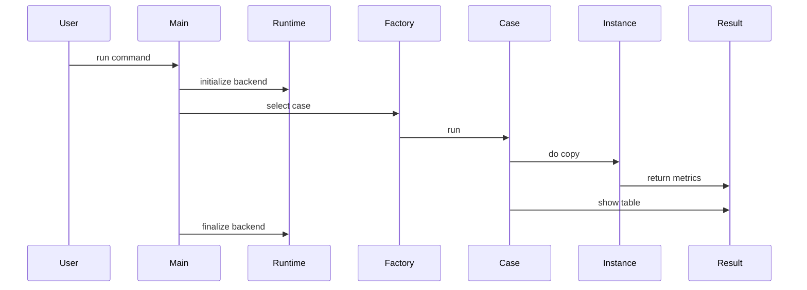
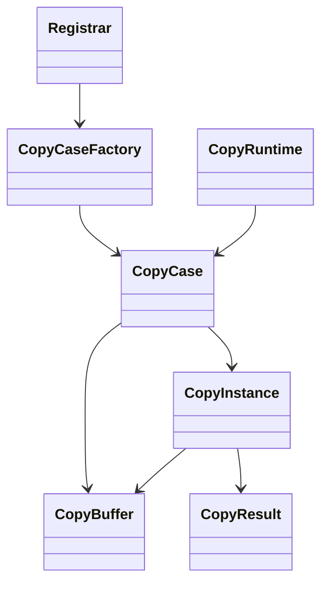
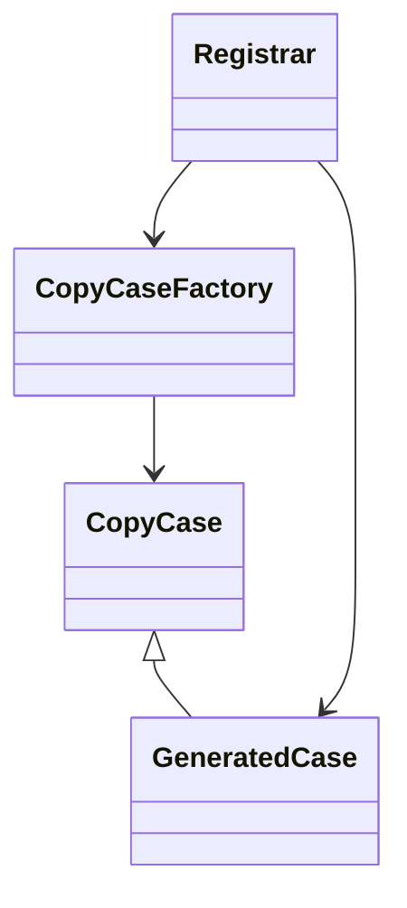
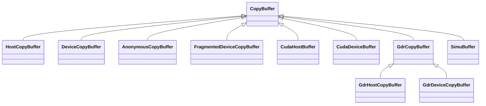
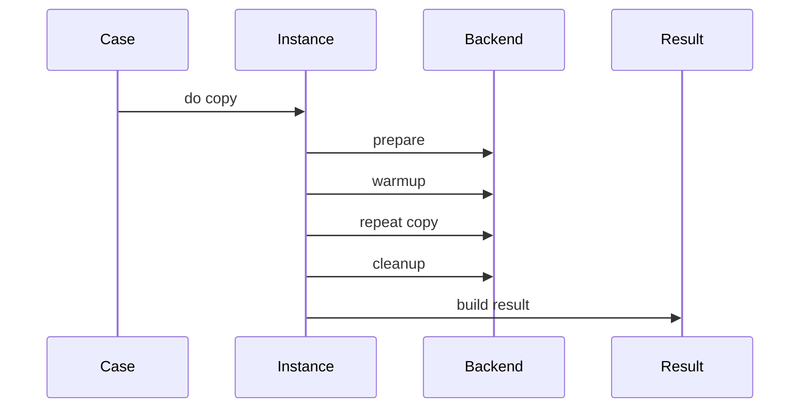
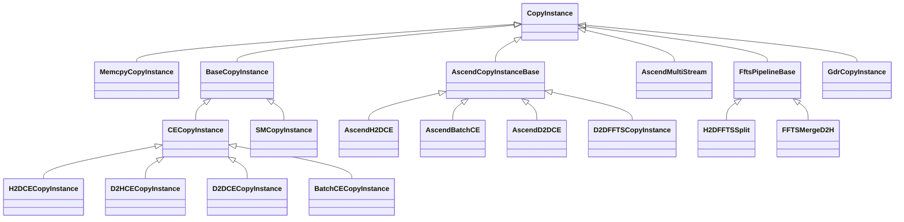
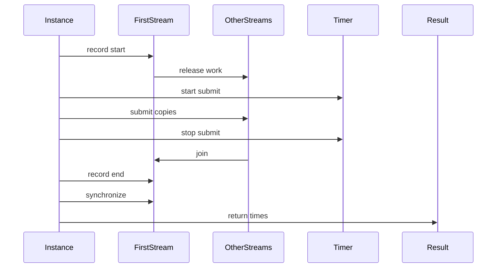
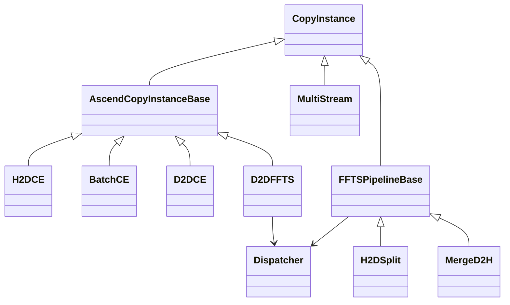

# Copy 模块代码结构解析

## 一句话总览

`copy` 模块的代码思想是：把“要测什么”与“怎么搬数据”拆开。

- `CopyCase` 表达一个 benchmark 场景，例如 Host 到 Device、Device 到 Device、一对多、全设备并发。
- `CopyBuffer` 表达内存在哪里、怎么按 index 取每个 buffer。
- `CopyInstance` 表达一次 copy 方法怎么准备、怎么提交、怎么计时、怎么清理。
- `CopyResult` 统一展示不同方法的 submit time、copy time 和 bandwidth。
- CMake 根据 runtime backend 只编译一套后端实现，例如 CUDA、Ascend 或 Simu。

所以整体不是“每个 case 自己写完整 benchmark”，而是 case 层负责组合 buffer 和 instance，instance 层复用统一测量框架。

## 目录结构

核心抽象在 `module/copy` 根目录：

`@module/copy/copy_main.cc`

`@module/copy/copy_case.h`

`@module/copy/copy_instance.h`

`@module/copy/copy_buffer.h`

`@module/copy/copy_result.h`

`@module/copy/copy_runtime.h`

后端实现按目录隔离：

`@module/copy/ascend`

`@module/copy/cuda`

`@module/copy/simu`

CUDA GDR 扩展放在：

`@module/copy/cuda/gdr`

编译选择在：

`@module/copy/CMakeLists.txt`

## 整体执行链路



执行时的关键步骤：

1. `copy_main.cc` 解析 CLI 参数，形成 `CopyCase::Context`。
2. `CopyRuntime` 初始化后端 runtime。
3. `CopyCaseFactory` 根据 `-t` 选择 case。
4. case 创建 source buffer 和 destination buffer。
5. case 创建对应 copy instance。
6. instance 完成 warmup、iteration、submit/copy 计时。
7. case 把结果放入 `CopyResult` 并打印表格。

## 核心类关系



这张图表达的是核心依赖方向：

- `CopyCaseFactory` 保存所有注册进来的 `CopyCase`。
- `Registrar` 是静态注册辅助类。
- `CopyCase` 负责选择 `CopyBuffer` 和 `CopyInstance`。
- `CopyInstance` 使用 `CopyBuffer` 的地址并输出 `CopyResult::Result`。
- `CopyRuntime` 不参与具体 case 逻辑，只负责 runtime 生命周期。

对应文件：

`@module/copy/copy_case.h`

`@module/copy/copy_instance.h`

`@module/copy/copy_buffer.h`

`@module/copy/copy_result.h`

`@module/copy/copy_runtime.h`

## CopyCase 与注册机制

`CopyCase` 是 case 的基类。它只保存两个信息：

- `key`：CLI 里 `-t` 使用的 case 名称。
- `brief`：展示 case 列表时的说明。

每个具体 case 都通过 `DEFINE_COPY_CASE` 宏定义。这个宏会做两件事：

1. 生成一个继承自 `CopyCase` 的 case 类。
2. 创建一个静态 `Registrar`，把 case 注册到 `CopyCaseFactory`。

这是一种轻量插件式注册。添加新 case 时不需要改一个全局 switch，只要在某个 case 文件里写一个新的 `DEFINE_COPY_CASE`。



对应文件：

`@module/copy/copy_case.h`

Ascend case 示例：

`@module/copy/ascend/copy_case_ascend.cc`

`@module/copy/ascend/copy_case_ffts_d2d_ascend.cc`

CUDA case 示例：

`@module/copy/cuda/copy_case_cuda.cc`

Simu case 示例：

`@module/copy/simu/copy_case_simu.cc`

## CopyCase::Context

所有 case 共用同一个 `Context`：

- `size`：单个 buffer 或 fragment 的大小。
- `num`：buffer 数量。
- `iter`：正式迭代次数。
- `nDevice`：设备数量。

这个设计让 CLI 保持简单。case 内部决定如何解释这些参数。例如：

- 单设备 H2D：每个 device 创建一组 host/device buffer。
- all host to all device：创建多组 buffer，交给一个 instance 批量运行。
- FFTS pipeline：`size * num` 作为大 IO 总 payload，`num` 仍表示 fragment 数。

对应文件：

`@module/copy/copy_case.h`

`@module/copy/copy_main.cc`

## CopyBuffer 继承关系

`CopyBuffer` 是所有 buffer 的基类。它保存：

- `device`
- `size`
- `number`
- `addr`

默认 `At` 逻辑是连续内存切片：

```text
base + index * size
```

如果某个 buffer 不是连续大块，就重写 `At`。



说明：

- Ascend 的 `HostCopyBuffer` 使用 ACL host allocation。
- Ascend 的 `DeviceCopyBuffer` 使用 ACL device allocation。
- Ascend 的 `FragmentedDeviceCopyBuffer` 每个 fragment 单独分配，并重写 `At`。
- CUDA 后端有自己的 host/device/anonymous buffer。
- GDR buffer 在普通 CUDA allocation 之外，还维护 RDMA memory region。
- Simu 后端用普通内存模拟 copy 行为。

对应文件：

`@module/copy/copy_buffer.h`

`@module/copy/ascend/copy_buffer_ascend.h`

`@module/copy/cuda/copy_buffer_cuda.h`

`@module/copy/cuda/gdr/copy_buffer_gdr.h`

`@module/copy/simu/copy_buffer_simu.h`

## CopyInstance 的模板方法思想

`CopyInstance` 是测量框架的基类。它把一次 benchmark 固定成几个阶段：

1. `Prepare`
2. warmup
3. 多轮 `DoCopyOnce`
4. `Cleanup`
5. 生成 `CopyResult::Result`

这就是典型的模板方法思想：基类固定流程，子类填具体行为。



对应文件：

`@module/copy/copy_instance.h`

## CopyInstance 继承关系



这张图里有几类分支：

- `MemcpyCopyInstance`：Simu 后端，直接用 `memcpy`，submit 和 copy 时间相同。
- CUDA `BaseCopyInstance`：统一管理 CUDA stream、event、submit 计时和 copy 计时。
- Ascend `AscendCopyInstanceBase`：统一管理 ACL stream、event、submit 计时和 copy 计时。
- `H2DCEMultiStreamCopyInstance`：Ascend 多 stream H2D 特化，直接继承 `CopyInstance`，因为它要把同一组 buffer 分配到多个 stream。
- `D2DFFTSCopyInstance`：继承 Ascend 通用测量基类，但 `CopyInternal` 里不是循环 CE，而是构造 FFTS task。
- `FftsPipelineCopyInstanceBase`：FFTS H2D/D2H pipeline 特化，直接继承 `CopyInstance`，因为它有 intermediate transfer buffer。
- `GdrCopyInstance`：直接继承 `CopyInstance`，因为 RDMA write 的提交和等待逻辑与 CUDA stream event 不同。

对应文件：

`@module/copy/simu/copy_instance_simu.h`

`@module/copy/cuda/copy_instance_cuda.h`

`@module/copy/ascend/copy_instance_ascend.h`

`@module/copy/ascend/copy_instance_ffts_ascend.h`

`@module/copy/ascend/copy_instance_ffts_pipeline_ascend.h`

`@module/copy/cuda/gdr/copy_instance_gdr.h`

## 后端通用测量框架

CUDA 的 `BaseCopyInstance` 和 Ascend 的 `AscendCopyInstanceBase` 思想几乎一致：

1. `Prepare` 把 `CopyBuffer` 转成 stream context。
2. 为每组 buffer 创建 stream 和 end event。
3. 在第一个 stream 上记录 total start event。
4. 其他 stream 等待 total start event。
5. 记录 CPU submit start。
6. 每个 context 执行 backend copy。
7. 记录 CPU submit end。
8. 每个 stream 记录自己的 end event。
9. 第一个 stream 等待其他 stream 的 end event。
10. 第一个 stream 记录 total end event。
11. 同步并计算 event elapsed time。



这个框架的好处是：

- 多设备或多 buffer batch 可以复用一套计时逻辑。
- 子类只需要实现“往 stream 里提交什么 copy”。
- submit time 和 copy time 的口径在同一后端内保持一致。

对应文件：

`@module/copy/cuda/copy_instance_cuda.h`

`@module/copy/ascend/copy_instance_ascend.h`

## Case 层与 Instance 层的分工

case 层做场景组合：

- 创建什么 source buffer。
- 创建什么 destination buffer。
- 遍历多少 device。
- 是否把多个 device 的 buffer 一次性交给 instance。
- 选择哪个 copy instance。
- 展示结果。

instance 层做执行方法：

- 怎么准备 stream/context。
- 怎么提交 copy。
- 怎么同步。
- 怎么统计时间。
- 怎么返回结果。

这种分工让同一个 instance 可以服务多个 case。例如 H2D CE copy instance 可以被单设备 H2D、一对多 H2D、全设备 H2D 等 case 复用。

对应文件：

`@module/copy/ascend/copy_case_ascend.cc`

`@module/copy/cuda/copy_case_cuda.cc`

## Runtime 抽象

`CopyRuntime` 是一个很薄的 RAII 外壳：

- CUDA 后端一般负责 CUDA runtime 生命周期。
- Ascend 后端构造时调用 `aclInit`，析构时调用 `aclFinalize`。
- Simu 后端通常没有真实 runtime 初始化。

`copy_main.cc` 只创建一个 `CopyRuntime runtime`，不关心具体后端怎么初始化。

对应文件：

`@module/copy/copy_runtime.h`

`@module/copy/ascend/copy_runtime_ascend.cc`

`@module/copy/cuda/copy_runtime_cuda.cc`

`@module/copy/simu/copy_runtime_simu.cc`

## CMake 后端选择思想

`copy` 只生成一个 binary，但源码由 `RUNTIME_BACKEND` 决定：

- CUDA 后端：编译 `cuda` 目录源码，并按条件接入 GDR。
- Ascend 后端：编译 `ascend` 目录源码，按条件接入 FFTS case。
- 其他情况：编译 `simu` 目录源码。

这样 CLI、case 抽象和输出格式保持一致，后端差异被放到目录和 CMake 条件里。

对应文件：

`@module/copy/CMakeLists.txt`

## CopyResult 输出模型

`CopyResult` 不参与 copy 执行，只负责统计和展示。

每个 `CopyResult::Result` 包含：

- source 名称
- destination 名称
- method 名称
- 单个 buffer size
- buffer count
- submit cost 数组
- copy cost 数组

它会计算：

- min
- max
- avg
- p50
- p90

带宽计算口径是：

```text
size * count / avg copy time
```

所以 `BW(GB/s)` 表示有效 payload 带宽，不一定等于硬件物理搬运总量。例如 FFTS H2D pipeline 里，输出带宽按用户侧 payload 算一次，不把大 H2D 和 device 内 split 叠加成两份 payload。

对应文件：

`@module/copy/copy_result.h`

## Ascend 后端结构

Ascend 后端主要分四块：

- 普通 CE copy：H2D、D2D、batch、multi-stream。
- FFTS D2D：把多个 device 内 copy 合成一次 FFTS launch。
- FFTS pipeline：H2D 大 IO + FFTS split，以及 FFTS merge + D2H 大 IO。
- buffer/runtime/error handling。



设计上的重点：

- 普通 CE 路径复用 `AscendCopyInstanceBase`。
- 多 stream CE 自己管理多个 stream，所以直接继承 `CopyInstance`。
- 纯 D2D FFTS 可以复用 `AscendCopyInstanceBase`，因为它仍然是 source/destination 两端模型。
- H2D/D2H FFTS pipeline 需要 intermediate transfer buffer，所以单独引入 `FftsPipelineCopyInstanceBase`。

对应文件：

`@module/copy/ascend/copy_instance_ascend.h`

`@module/copy/ascend/copy_instance_ffts_ascend.h`

`@module/copy/ascend/copy_instance_ffts_pipeline_ascend.h`

`@module/copy/ascend/ffts_d2d_dispatcher_ascend.h`

## CUDA 后端结构

CUDA 后端普通 copy 主要围绕 `BaseCopyInstance`：

- `CECopyInstance` 封装 stream synchronize。
- H2D、D2H、D2D CE copy 继承 `CECopyInstance`，只改 copy direction。
- Batch CE copy 继承 batch 基类，调用 CUDA batch copy API。
- SM copy 使用 CUDA kernel 做批量 copy。

GDR 扩展不复用 CUDA stream event 框架，而是单独用 RDMA channel 提交 write 并等待 completion。

对应文件：

`@module/copy/cuda/copy_instance_cuda.h`

`@module/copy/cuda/gdr/copy_instance_gdr.h`

`@module/copy/cuda/gdr/rdma_channel_gdr.h`

## Simu 后端结构

Simu 后端最简单。它用 `MemcpyCopyInstance` 直接在 CPU 内存之间 `memcpy`，主要用于没有真实 CUDA 或 Ascend runtime 时验证 copy 框架。

它仍然继承 `CopyInstance`，所以 case、result、CLI 口径和真实后端一致。

对应文件：

`@module/copy/simu/copy_instance_simu.h`

`@module/copy/simu/copy_case_simu.cc`

## 代码思想总结

### 一层抽象对一类变化

模块里每个抽象都对应一个变化点：

- `CopyCase` 应对 benchmark 场景变化。
- `CopyBuffer` 应对内存类型和地址组织变化。
- `CopyInstance` 应对 copy 方法变化。
- `CopyRuntime` 应对后端 runtime 生命周期变化。
- `CopyResult` 固化输出格式，避免每个 case 自己打印。

### 用继承固定接口，用组合表达实验

继承主要用于统一接口：

- 所有 case 都是 `CopyCase`。
- 所有 buffer 都是 `CopyBuffer`。
- 所有 copy 方法都走 `CopyInstance`。

组合发生在 case 层：

```text
case = buffers + instance + context
```

这也是新增实验最常走的路线：优先复用已有 buffer 和 instance；只有当执行模型不匹配时，再新增 instance。

### 测量口径集中在 Instance

submit time、copy time、warmup、iteration 这些口径集中在 `CopyInstance` 和后端 base instance 中。

好处是：

- case 层不会散落计时代码。
- 同一后端下不同 case 的输出更容易比较。
- 新增 copy 方法时，只要复用 base instance，统计口径就自然一致。

### 后端隔离，CLI 统一

用户看到的是同一个 `copy` 命令和同一张输出表。后端差异由 CMake 和目录隔离处理。

这让 `host_to_device_ce` 这样的 case name 在 CUDA 和 Ascend 下可以表达同类实验，但底层 runtime API 完全不同。

## 新增一个 Copy Case 的推荐路径

如果要新增一个普通 source 到 destination 的 copy case：

1. 确认现有 `CopyBuffer` 是否足够。
2. 确认现有 `CopyInstance` 是否能表达 copy 方法。
3. 如果能复用，只在对应 backend 的 case 文件里新增 `DEFINE_COPY_CASE`。
4. 如果不能复用，再新增一个继承 `CopyInstance` 或后端 base instance 的类。
5. 保持结果通过 `CopyResult` 输出。

如果 copy 需要第三种中间 buffer，例如 FFTS pipeline，就不要强塞进普通 source/destination base class，应该像 `FftsPipelineCopyInstanceBase` 一样单独建一个更贴近真实执行模型的 instance。

## 推荐阅读顺序

1. `@module/copy/copy_main.cc`
2. `@module/copy/copy_case.h`
3. `@module/copy/copy_instance.h`
4. `@module/copy/copy_buffer.h`
5. `@module/copy/copy_result.h`
6. `@module/copy/ascend/copy_case_ascend.cc`
7. `@module/copy/ascend/copy_instance_ascend.h`
8. `@module/copy/ascend/copy_case_ffts_d2d_ascend.cc`
9. `@module/copy/ascend/copy_instance_ffts_pipeline_ascend.h`

这个顺序会先建立框架感，再看一个具体后端，最后看更特殊的 FFTS pipeline。
